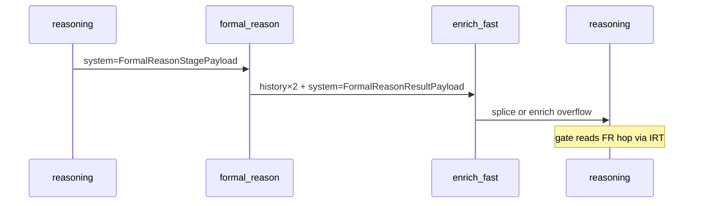

# Formal_reason gate и relay `<system>` (machine payload)

> **Граница документов.** Общий контракт `<history>` / `<system>`, CID, origin, дедуп,
> сбор `enrich_fast`, матрица стадий и презентация `<conversation_delta>` — только в
> [`CONTEXT_CONTRACT.md`](CONTEXT_CONTRACT.md). **Здесь** — исключительно цикл
> `formal_reason`, machine payload `FormalReasonResultPayload`, проброс `@system` в этом
> цикле и FSM gate на входе `reasoning`.
>
> **См. также:** [`FSM.md` §5.2](FSM.md#52-контракт-тела-enrich--reasoning),
> [`TYPES.md`](TYPES.md). Код: `threlium/formal_reason_gate.py`,
> `threlium/states/formal_reason.py`, `threlium/states/enrich_fast.py`.

---

## 1. Два канала в цикле formal_reason

Для этого tool-callee действуют общие правила [`CONTEXT_CONTRACT.md` §1–3](CONTEXT_CONTRACT.md);
ниже — **кто что читает именно для gate**.

| Канал | Кто читает | Содержимое |
|-------|------------|------------|
| `<hash@history>` | LLM (`reasoning/user.j2`) | `observation_*.j2`, request-echo |
| `<hash@system>` | `formal_reason_gate` | JSON `FormalReasonResultPayload` |

Gate **не** парсит prose (`QUERY ERROR`, `FSM locked` в observation). Источник истины FSM —
`<system>` с JSON на письме **`formal_reason@ → enrich_fast@`**, найденном в **IRT-дельте**
текущего reasoning-hop (обход лист→корень до watermark `To: reasoning@localhost`;
`formal_reason_result_from_irt_delta`). Relay `<system origin=formal_reason>` на spliced
конверте — дополнительно для fast path (`assert_formal_reason_relay_after_splice`), не
единственный источник gate (overflow `enrich@` не ломает gate). Битый JSON →
`RuntimeError` (§4), не silent full toolset.

---

## 2. Поток и место в матрице стадий

Строка матрицы emit: [`CONTEXT_CONTRACT.md` §3](CONTEXT_CONTRACT.md) (`formal_reason` →
`enrich_fast`: echo + observation + `<system>`). Сквозной пример CID без gate-деталей —
тот же документ §8 (краткая отсылка).

**IRT-окно gate (основной путь):**

- Лист — `Message-ID` текущего письма `reasoning@`; предки по `In-Reply-To` до ближайшего
  `To: reasoning@` (граница `E_prev`).
- В окне берётся **первый** (новейший) снимок `From: formal_reason@localhost`; с диска
  читается `<system>` → `FormalReasonResultPayload`.
- Hop formal_reason ещё не завершён (нет `From: formal_reason` в окне) → gate OFF.

**Relay `<system>` на spliced конверте (fast path, I2):**

- `splice_e_prev_with_history` **не копирует** `@system` из `E_prev` — только `system_parts`
  текущей дельты; `assert_formal_reason_relay_after_splice` проверяет relay при under-budget.
- Technical failure **вне** текущей IRT-дельты не активирует gate.

---

## 3. Классификация исхода и gate

Классификация при emit (`compute_formal_reason_outcome` в `formal_reason.py`):

| Условие | `FormalReasonOutcome` |
|---------|------------------------|
| `error_kind` ≠ `NONE` | `technical_failed` |
| supplemental `query` / `derived` error | `technical_failed` |
| `not conforms` или `violations > 0` | `shacl_negative` |
| иначе | `passed` |

| Outcome | Gate | Tools при `remaining_hops ≥ 1` |
|---------|------|--------------------------------|
| `technical_failed` | ON | `formal_reason`, `memory_query` |
| `shacl_negative`, `passed` | OFF | `REASONING_TARGET_STAGES` |

Последний валидный payload для gate — **новейший** hop `formal_reason@` в IRT-окне (одна
`<system>` на hop-письме).

**Приоритет в `reasoning._decide`:** hop budget (`remaining < 1` → только `finalize`) **выше**
gate; при gate ON — `reasoning/formal_reason_gate.j2`; wrong-tool retries упираются в hop
budget, не в отдельный settings-порог.

SHACL negative намеренно **не** включает gate (модель может идти в `response_finalize`).

---

## 4. Строгие инварианты (fail)

| # | Инвариант | Проверка |
|---|-----------|----------|
| I1 | В IRT-окне есть `From: formal_reason@` → `<system>` hop-письма парсится в `FormalReasonResultPayload` | `formal_reason_result_from_irt_delta` / `require_formal_reason_result_payload` |
| I2 | В дельте был `From: formal_reason@localhost` → на spliced-конверте есть relayed `<system origin=formal_reason>` | `assert_formal_reason_relay_after_splice` в `enrich_fast` |
| I3 | Gate не читает `<history>`, нет legacy без `<system>` | по дизайну |

---

## 5. Код и JSON

| Модуль | Роль |
|--------|------|
| `formal_reason_gate.py` | `formal_reason_gate_active`, `formal_reason_result_from_irt_delta`, strict parse, `delta_had_formal_reason` |
| `states/formal_reason.py` | SHACL/SPARQL, emit observation + result JSON |
| `states/enrich_fast.py` | `_collect_delta_system_parts`, splice, assert relay |
| `states/reasoning.py` | `compute_allowed_routes`, `_decide` |

`FormalReasonResultPayload` в `<system>`: `outcome`, `error_kind`, `conforms`, `violations`,
`has_query_error`, `has_derived_error` — см. [`TYPES.md`](TYPES.md).

Вход стадии: `FormalReasonStagePayload` в единственной `<system>` письма `reasoning →
formal_reason` (`system_part_text`, [`CONTEXT_CONTRACT.md` §2](CONTEXT_CONTRACT.md)).

---

## 6. Промпты

| Файл | Роль |
|------|------|
| `formal_reason/observation_*.j2` | Prose → `<history>` |
| `reasoning/formal_reason_gate.j2` | Notice при gate ON |
| `reasoning/system.j2` | `formal_reason_strategy`, hop budget |
| `reasoning/formal_reason/tool_spec.j2` | Схема tool_call |

---

## 7. Отладка

1. В IRT-окне reasoning-листа: есть `From: formal_reason@`? `<system>` на hop-письме — валидный JSON?
2. (fast path) `enrich_fast@` → `reasoning@`: relayed `<system origin=formal_reason>`?
3. `outcome` и tools в LiteLLM соответствуют таблице §3?

E2e-покрытие (журнал WireMock, `tests/e2e/formal_reason_assertions.py`):

| Сценарий | Модуль |
|----------|--------|
| QUERY ERROR → gate ON → retry `formal_reason` → gate OFF + finalize | `test_formal_reason_technical_gate_e2e.py` |
| `shacl_negative` → gate OFF + finalize | `test_formal_reason_violation_e2e.py` |
| `passed` + `memory_query` без gate | `test_formal_reason_chain_e2e.py` |
| `passed` + query, gate OFF | `test_formal_reason_query_e2e.py` |
| inference success, gate OFF | `test_formal_reason_inference_e2e.py` |
| parse fatal → gate → `memory_query` под gate → QUERY ERROR → recovery → finalize; накопление observation/tool-call через enrich_fast | `test_formal_reason_gate_recovery_matrix_e2e.py` |
