# Threlium: оркестрация стадий FSM

Документ задаёт соглашения по параллелизму и порядку обработки писем в стадиях FSM:

- **Serial-per-thread, parallel-across-threads.** В пределах одного notmuch-треда — строгий порядок FIFO (oldest-first); несвязанные треды обрабатываются независимо.
- **systemd-native orchestration.** Долгоживущий демон `threlium-engine.service` (`python -m threlium.runners.engine`) держит предзагруженный процесс и UNIX-сокет под `$THRELIUM_HOME/locks/threlium-engine.sock`. Терминирующая доставка — **`fdm`** (`~/.fdm.conf`): `match` + `pipe` → `notmuch insert … && threlium-dispatch.sh`; dispatch запрашивает `notmuch search --output=threads "tag:unread AND folder:<stage>/Maildir"` и одним вызовом `systemctl --user start --no-block` поднимает инстансы `threlium-work@<stage>:<thread_id>.service`. Каждый инстанс выполняет только `python -m threlium.runners.engine_submit %i` (JSON в сокет движку). Имя инстанса `<stage>:<thread_id>` служит per-thread мьютексом; у шаблона воркера в `[Unit]` — **`BindsTo=`** и **`After=`** на `threlium-engine.service`. Демон движка — **`Type=notify`**: после привязки сокета шлёт `READY=1` и может обновлять `STATUS=` (пакет `threlium.systemd_notify`, см. [§6](#6-юниты-systemd-пути-имена-окружение)); мосты и submit тоже могут слать `STATUS=` для `systemctl status`.
- **Event-driven.** Опроса очереди и `flock` нет. После **успешного** завершения submit (`exit 0`) в `[Unit]` воркера срабатывает **`OnSuccess=threlium-sweep@%i.service`**: юнит sweep вызывает тот же `threlium-dispatch.sh %i` — перепроверка backlog (race backstop для хвоста unread). При ошибке submit **`OnSuccess` не срабатывает** — только **`Restart=on-failure`**.

Структура сообщений, имена файлов, канонизация идентификаторов `Message-ID` / `In-Reply-To` / `References`, модуль `threlium.types` (канонизация id, см. MESSAGES §2), раскладка хранения и индексация `notmuch` — в [`MESSAGES.md`](MESSAGES.md); канонические имена служебных заголовков `X-Threlium-*` на wire — в [§8](MESSAGES.md#8-canonical-x-threlium-headers-glossary). Контракт Python-скрипта стадии (модуль `threlium.states.<stage>` как функция-состояние `(EmailMessage, stage: FsmStage) → EmailMessage | None`, вызываемая воркером in-process, билдеры MIME, граф состояний FSM) — в [`FSM.md`](FSM.md). Смежные контракты: [`SUBAGENT_TABLE.md`](SUBAGENT_TABLE.md) (FSM-шаги, матрица стеков), [`MEMORY_TABLE.md`](MEMORY_TABLE.md) (память, теги `notmuch`), [`ARCHITECTURE.md`](ARCHITECTURE.md) (общая архитектура, **fdm** + `notmuch insert` в [§8.4](ARCHITECTURE.md#84-доставка-maildrop), `litellm`/LLM tool-calling в [§8.7](ARCHITECTURE.md#87-llm-и-lightrag), изоляция `cli_exec` в [§6](ARCHITECTURE.md#6-слой-cli-и-безопасность-исполнения)).

---

## 1. Целевые инварианты

- **Serial-per-thread.** В пределах одного notmuch-треда (определяемого notmuch threading engine по `Message-ID:` / `In-Reply-To:` / `References:`) порядок обработки — строгий FIFO (oldest-first): воркер за одну активацию обрабатывает ровно одно (самое старое unread) письмо треда; следующее письмо того же треда обработается следующей активацией воркера с тем же `<thread_id>`.
- **Parallel-across-threads.** Письма, принадлежащие разным notmuch-тредам, обрабатываются независимо и параллельно (разные `<thread_id>` = разные инстансы воркера).
- **Порядок между тредами не важен.** Никакой глобальной приоритизации тредов по возрасту и никакого fairness-планировщика нет — какой тред свободен (нет активного инстанса воркера), тот и подхватывается очередным слотом. Очерёдность определяется только `systemd`/планировщиком ОС.

**Notmuch `thread_id` — стабильный ключ треда.** В отличие от прежней архитектуры (ADL), где ключом инстанса воркера служил b62-корень «локального треда в очереди `new/`» — величина, менявшаяся по мере продвижения треда, — теперь используется **notmuch `thread_id`**: стабильный идентификатор, присваиваемый notmuch threading engine'ом при `notmuch insert` и не меняющийся на протяжении всей жизни треда ([§2](#2-notmuch-thread_id-как-ключ-инстанса-воркера)). Это упрощает модель: имя инстанса `threlium-work@<stage>:<thread_id>.service` однозначно идентифицирует тред, сериализация гарантируется `systemd` (один инстанс = один тред), а внутри треда FIFO-порядок обеспечивается notmuch-query с `sort_newest_first=False`. Подробный разбор механики — в [§3](#3-механизм-post-insert-hook--dispatch-script).

---

## 2. Notmuch `thread_id` как ключ инстанса воркера

**Начиная с post-insert архитектуры** ключ инстанса воркера — **notmuch `thread_id`** (шестнадцатеричная строка, присваиваемая notmuch threading engine'ом при `notmuch insert` на основе `Message-ID:` / `In-Reply-To:` / `References:`). Имя инстанса `threlium-work@<stage>:<thread_id>.service` — per-thread мьютекс в терминах `systemd` ([§3](#3-механизм-post-insert-hook--dispatch-script)).

**Почему `thread_id` подходит:**

- **Стабильность.** `thread_id` не меняется по мере продвижения треда: он одинаков для всех сообщений треда в union notmuch index'е. В прежней архитектуре (ADL) ключом был b62-корень «локального треда в очереди `new/`», который менялся после каждого `nm_settle` — имя инстанса зависело от текущего содержимого `new/`, что требовало Python-диспетчера с `_walk_to_root` для определения корня. Теперь достаточно одного `notmuch search --output=threads` в shell-скрипте.
- **Доступность.** `fdm` делает терминирующий `notmuch insert` ([`INDEX.md` §4](INDEX.md#4-mailfilter-terminating-insert)), поэтому `thread_id` **всегда доступен** в момент запуска dispatch-скрипта — индексация синхронна с доставкой, race'а «файл есть, но notmuch ещё не знает» нет.
- **FIFO внутри треда.** Notmuch query `tag:unread AND to:<stage>@localhost AND thread:<thread_id>` с `sort_newest_first=False` даёт самое старое unread-письмо треда — serial-per-thread (oldest-first FIFO) обеспечивается атомарно одним запросом, без ручного обхода графа `In-Reply-To:`.
- **Единообразие.** `thread_id` используется и в оркестрации стадий (ключ инстанса воркера), и в FSM-стадиях (union notmuch index как event-store: `enrich`-барьер, память, `egress_router`; см. [`INDEX.md` §7](INDEX.md#7-enrich-notmuch-context--query--lightrag), [`ARCHITECTURE.md`](ARCHITECTURE.md), [`SUBAGENT_TABLE.md`](SUBAGENT_TABLE.md), [`MEMORY_TABLE.md`](MEMORY_TABLE.md)) — одна сущность вместо двух.

**ADL: прежняя архитектура.** До post-insert архитектуры использовалось понятие «корня локального треда в очереди `new/`» — b62-id `Message-ID:` того файла, у которого `In-Reply-To:` указывает за пределы `new/`. Это требовало Python-диспетчера (`dispatcher.py`) с `_build_index` + `_walk_to_root` по заголовкам, `systemd.path` (`PathChanged=.../new/`) для запуска диспетчера, и давало нестабильный ключ инстанса, который менялся при каждом `nm_settle`. Модуль `dispatcher.py` и юниты `threlium-stage@.path` / `threlium-stage@.service` удалены.

---

## 3. Механизм: post-insert hook + dispatch script

Оркестрация построена на компонентах ниже; sweep запускается **только после успешного exit** воркера (`OnSuccess`), см. подпункт **Sweep**.

- **fdm pipeline** — в [`fdm.conf.j2`](../ansible/roles/threlium/templates/config/fdm.conf.j2) каждая терминирующая доставка — `pipe` на `notmuch insert … && …/threlium-dispatch.sh`. После успешного `notmuch insert` тот же shell запускает dispatch; `THRELIUM_STAGE` задаётся в env внутри `pipe` и наследуется dispatch-скриптом. Отдельного notmuch `hook_dir` нет.
- **Dispatch script** — [`scripts/threlium-dispatch.sh`](../ansible/roles/threlium/templates/scripts/threlium-dispatch.sh.j2): тонкий shell-скрипт, **без Python**. Делает `notmuch search --exclude=false --output=threads "tag:unread AND folder:${STAGE}/Maildir"`, собирает имена unit-ов `threlium-work@${STAGE}:<id>.service` (`<id>` — суффикс после префикса `thread:` в выводе CLI) и **одним** вызовом `systemctl --user start --no-block` передаёт весь список. Скрипт **fail-fast** (`set -e`): ошибки `notmuch search` и `systemctl` не подавляются; при сбое пайпа fdm или sweep завершаются с ненулевым кодом **после** того, как `notmuch insert` уже записал письмо в индекс — откат insert notmuch не гарантируется. Семантика ошибки при нескольких unit-ах — см. `systemctl(1)`. Скрипт вызывается из двух мест: (1) сразу после insert из fdm (основной триггер) и (2) `threlium-sweep@.service` после **успешного** завершения воркера (`OnSuccess`). При вызове из sweep принимает `%i` (`<stage>:<thread_id>`) как `$1` и извлекает `STAGE` из него через `${1%%:*}`.
- **Воркер** — инстанс единого template-сервиса `threlium-work@<stage>:<thread_id>.service`. Один инстанс = один тред; имя инстанса (`<stage>:<thread_id>`) — per-thread мьютекс в терминах `systemd`. `ExecStart=… python -m threlium.runners.engine_submit %i` → JSON в UNIX-сокет демона [`threlium.runners.engine`](../ansible/roles/threlium/files/scripts/threlium/runners/engine/). Обрабатывается ровно **одно** unread-письмо треда (oldest-first FIFO) за активацию submit. Стадию и `thread_id` движок получает из JSON (эквивалент разбора `%i`). Поиск файла — через notmuch query `tag:unread AND to:<stage>@localhost AND thread:<thread_id>` с `sort_newest_first=False` (`nm.first_message_path`). Handler стадии вызывается **in-process в движке**: чтение Maildir-файла (`file_path.read_bytes()`), парсинг через `email_message_from_bytes` / `parse_rfc822`, **требует** непустой `Message-ID` (inner), иначе `RuntimeError` ([`FSM.md` §4.2](FSM.md#42-что-делает-воркер-перед-вызовом-handler-а)), проверяет `FsmStage.from_incoming_to(msg)` и вызывает ``main(msg, stage_vo, config=Config.from_os())`` через `importlib.import_module(f"threlium.states.{stage_vo.value}")` (``Config`` — ``threlium.config``). При непустом результате — сериализация `out.as_bytes(policy=RFC822_FOR_INSERT)` (`mime_reform`) → `run_fdm` (stdin — байты письма; маршрут в `~/.fdm.conf` — по заголовку `To:`). `nm_settle()` — общий хелпер из `threlium.nm` ([`INDEX.md` §5.5.3](INDEX.md#553-notmuch-consistency-через-notmuch2mutabletagset), [`INDEX.md` §10 решение 3](INDEX.md#10-architectural-decisions-log)) делает `with db.atomic(): msg.tags.discard("unread"); msg.tags.to_maildir_flags()`. Переход `new/<id>` → `cur/<id>:2,S` делает `MutableTagSet.to_maildir_flags()`: libnotmuch вызывает `rename(2)` (POSIX-атомарно, не откатывается abort'ом транзакции) и накапливает path-update в Xapian-дельте, коммитящейся на выходе из `db.atomic()` — формальная декомпозиция в [`INDEX.md` §5.5.3](INDEX.md#553-notmuch-consistency-через-notmuch2mutabletagset). На старте каждого worker'а вызывается `settle_recovery_for_stage(stage_vo.value)` — лечит race-окно «после rename(2), до Xapian-commit» через `MutableTagSet.from_maildir_flags()` ([`INDEX.md` §9.1](INDEX.md#91-crash-matrix)). Universal error handling — [`INDEX.md` §5.6](INDEX.md#56-universal-error-handling-в-runnersworkerpy): при исключении в handler'е или сбое `run_fdm` движок возвращает ошибку клиенту submit → ненулевой exit процесса воркера (`Type=exec`); логика settle/truncate при ошибках — как в INDEX §5.6. Переменные окружения (`THRELIUM_HOME`, `PATH` с `.venv/bin`, секреты) задаются юнитом через `EnvironmentFile=` и `Environment=` — см. [§6](#6-юниты-systemd-пути-имена-окружение).
- **Sweep** — `threlium-sweep@<stage>:<thread_id>.service` (`Type=exec`, без `Restart=`), активируется через **`OnSuccess=threlium-sweep@%i.service`** в `[Unit]` шаблона `threlium-work@.service` — только если submit завершился с **`exit 0`**. При ошибке (`exit 1`) **`OnSuccess` не срабатывает**, дополнительного dispatch нет; срабатывает только **`Restart=on-failure`**. `ExecStart=threlium-dispatch.sh %i` — тот же dispatch-скрипт. Гарантирует перепроверку backlog: если после `nm_settle` в треде остались unread-письма, dispatch переиздаёт `start` для воркера. Race backstop: закрывает окно, в котором `fdm → notmuch insert → dispatch` уже отработали, а воркер ещё не завершился (повторный `start --no-block` на активный инстанс — no-op; после **успешного** выхода воркера sweep снова вызывает dispatch и подбирает хвост).

Ни dispatch-скрипт, ни воркер **не вызывают** `RfcMessageIdWire.from_native` / `RfcMessageIdWire.native_from_canonical_str`: канонизация — событие исключительно на **границе** системы (`ingress_<chan>`, `RfcMessageIdWire.internal_for_fsm()`, `egress_<chan>`; см. [`MESSAGES.md` §2](MESSAGES.md#2-канонизация-идентификаторов-на-границах-системы) и [`MESSAGES.md` §7](MESSAGES.md#7-новый-канал-чеклист)). Обратные преобразования id к внешнему виду (SMTP-`<…>`, Telegram `message_id`, Matrix `event_id`) — только в `egress_<chan>`-скриптах.

**`notmuch` оркестрационным слоем используется как thread-index + tag-scope.** Union notmuch index покрывает **все** stage Maildir'ы (`notmuch database.path = ~/threlium/stages`, [`INDEX.md` §10 решение 7](INDEX.md#10-architectural-decisions-log)). Dispatch ищет треды по Maildir стадии; воркер внутри треда сужает по `To:` и `thread:`.

- **Dispatch script** (список тредов со unread в очереди стадии): `notmuch search --output=threads "tag:unread AND folder:<stage>/Maildir"` — термин `folder:` относительно `database.path` (prefix-term, быстрее, чем `to:<stage>@localhost`). Письмо после insert лежит в `stages/<stage>/Maildir/new/` и попадает в этот запрос.
- **Worker** (одно oldest-unread письмо в известном треде): `nm.first_message_path("tag:unread AND to:<stage>@localhost AND thread:<thread_id>", sort_newest_first=False)` — один query, oldest-first, возвращает путь к файлу; заголовок `To:` сверяется с ожидаемой стадией.

Чтение тела писем оркестрацией по-прежнему не делается — только индексные query. Запись в notmuch — единственный канал — это `nm_settle()` и startup-recovery `settle_recovery_for_stage()`. `notmuch` также используется FSM-стадиями для чтения из union index'а (`enrich`-барьер, thread-lookup; см. [`INDEX.md` §7](INDEX.md#7-enrich-notmuch-context--query--lightrag), [`FSM.md` §4.5](FSM.md#45-границы-стадии-транспорт--снаружи-остальное--внутри)).

**Trade-off с прежней Python-диспетчерской архитектурой.** До текущей схемы диспетчер был Python-модулем (`dispatcher.py`), запускавшимся `systemd.path` (PathChanged на `new/`). Сейчас dispatch — тонкий shell-скрипт, вызываемый из fdm сразу после `notmuch insert`: на каждую доставку — один `notmuch search` + **один** батч `systemctl start` для всех найденных тредов. Нет cold-start Python для dispatch'а, нет `_build_index` / `_walk_to_root` — thread grouping делает notmuch threading engine (Xapian). Python cold-start для FSM — в долгоживущем **движке** `threlium-engine`; активация `threlium-work@` — только submit в Unix-сокет (без нового интерпретатора на каждый тред). Преимущество: проще, быстрее, меньше кода; dispatch-скрипт тривиален и не требует юнит-тестов.

Идея: **юнит-инстанс, именованный по `<stage>:<thread_id>`, сам служит мьютексом**. `systemd` гарантирует, что одновременно активен максимум один инстанс с конкретным именем, а инстансы с разными именами запускаются параллельно. Никаких `flock`, никакого внутреннего пула — каждая активация работает ровно с одним тредом и обрабатывает ровно одно (oldest-first) письмо.

**Цепочка запуска — кто кого поднимает (для одной стадии `<stage>`):**

```
fdm → notmuch insert --folder=stages/<stage>/Maildir
        │  && threlium-dispatch.sh (тот же shell после успешного insert)
        ▼
threlium-dispatch.sh                          ← DISPATCH SCRIPT (shell)
        │  (THRELIUM_STAGE наследуется из fdm env)
        │  notmuch search --output=threads "tag:unread AND folder:<stage>/Maildir"
        │  один вызов systemctl --user start --no-block threlium-work@<stage>:<tid> …
        ▼
threlium-work@<stage>:<thread_id>.service     ← Type=exec submit (один инстанс = один тред)
        │  ExecStart=python -m threlium.runners.engine_submit %i  → JSON в сокет движка
        ▼
threlium-engine.service                       ← ДЕМОН FSM (long-lived)
        │  python -m threlium.runners.engine  (GLOBAL_CFG один раз)
        │  nm.first_message_path("tag:unread … to:<stage>@localhost … AND thread:<tid>", oldest-first)
        │  → parse_rfc822 → main(msg, stage_vo, config=cfg) in-process
        │  → run_fdm (если handler вернул EmailMessage)
        │     └── fdm → notmuch insert && dispatch (рекурсивно)
        │  → nm_settle(file_path)
        ▼
threlium-sweep@<stage>:<thread_id>.service    ← SWEEP (Type=exec; старт через OnSuccess после exit 0 воркера)
        │  ExecStart=threlium-dispatch.sh %i
        │  перепроверяет "tag:unread AND folder:<stage>/Maildir"
        │  если есть хвост — переиздаёт start для воркера (race backstop)
        ▼
      (если новый start → повторный submit; если пусто → тишина)
```

Воркера запускает dispatch-скрипт (из fdm-пайпа после insert или из sweep после **успешного** завершения submit). Sweep активируется через `OnSuccess=` на воркере (не при `exit 1`). Никаких `systemd.path`, никаких таймеров, никаких `start` руками.

**Как круг замыкается (sweep после успеха).** Рассмотрим сценарий «тред из нескольких писем»:

1. Приходят письма `m1 ← m2 ← m3` (все принадлежат одному notmuch-треду `T`). `fdm → notmuch insert && dispatch` для каждого запускает dispatch script. Dispatch script находит один `thread:T` (у всех трёх `tag:unread` в `folder:<stage>/Maildir`) и делает `systemctl start --no-block threlium-work@<stage>:T.service`.
2. Воркер обрабатывает самое старое unread-письмо `m1` (oldest-first FIFO). Делает `nm_settle(m1)` — файл переезжает в `cur/m1:2,S`, тег `unread` снят. При непустом stdout — `fdm` доставляет результат на следующую стадию (при этом снова выполняется insert и dispatch для *следующей* стадии). Воркер завершается.
3. После **успешного** завершения воркера (`exit 0`) `OnSuccess` активирует `threlium-sweep@<stage>:T.service`. Sweep вызывает dispatch script: `notmuch search --output=threads "tag:unread AND folder:<stage>/Maildir"` — `m2`, `m3` всё ещё `unread` в `thread:T` → `systemctl start threlium-work@<stage>:T.service`.
4. Новый воркер обрабатывает `m2`. Цикл повторяется, пока тред не опустеет.
5. Когда sweep после обработки `m3` не находит unread-писем — ничего не запускает, тишина.

**Параллельность между тредами.** Если в момент dispatch'а `notmuch search` возвращает несколько `thread_id` (`T1`, `T2`, …), скрипт собирает их в один вызов `systemctl start --no-block` — `systemd` поднимает их параллельно (разные имена инстансов). `TasksMax=3` в `threlium-work.slice` ограничивает параллельность. Serial-per-thread гарантируется тем, что все письма одного notmuch-треда имеют одинаковый `thread_id` → одинаковое имя инстанса → `systemd` сериализует.

**Форк (`m1 ← {m2, m3}`).** Notmuch объединяет `m1`, `m2`, `m3` в один тред `T` (все имеют `In-Reply-To: <m1>`). Воркер обрабатывает их по одному (oldest-first FIFO), сериализация — через единственное имя инстанса `threlium-work@<stage>:T.service`. Если ветви форка попадают в **разные** notmuch-треды (что возможно, если notmuch не может связать их — например, обрыв `References:`), они получат разные `thread_id` и будут обработаны параллельно — корректно, т.к. notmuch гарантирует, что несвязанные сообщения не окажутся в одном треде.

**`python -m threlium.runners.engine_submit %i` + движок `threlium.runners.engine`.** Источник истины — пакет [`threlium/runners/engine/`](../ansible/roles/threlium/files/scripts/threlium/runners/engine/). Контекст стадии и треда передаётся в JSON на сокет (эквивалент `%i`). Движок десериализует файл (`parse_rfc822`), использует `Config` из старта демона и вызывает `threlium.states.<stage>.main(msg, stage_vo, config=cfg)` in-process. При непустом результате (`EmailMessage`) — сериализация и `run_fdm`. Handler — `(EmailMessage, stage: FsmStage, *, config: Config) → EmailMessage | None`; `None` ≡ терминальная стадия; **`fdm`** не вызывается при `None`.

**Алгоритм обработки одного запроса** (реализация — [`threlium/runners/engine/fsm.py`](../ansible/roles/threlium/files/scripts/threlium/runners/engine/fsm.py); полный контракт — [`INDEX.md` §5](INDEX.md#5-stage-workers-durable-maildirs)):

1. Разбор JSON/эквивалента `%i` — `stage` и `thread_id`; при невалидном вводе ошибка клиенту.
2. **`settle_recovery_for_stage(stage)`** на обработке запроса ([`INDEX.md` §9.1](INDEX.md#91-crash-matrix)) — как раньше.
3. **`_find_unread_in_thread(stage, thread_id)`** — `nm.first_message_path` с oldest-first.
4. Если нет unread — штатный `ok`, exit submit **0**.
5. **FSM-переход** — чтение файла, `parse_rfc822`, `main(..., config=GLOBAL_CFG)` in-process в движке.
6. **Universal error handling** ([`INDEX.md` §5.6](INDEX.md#56-universal-error-handling-в-runnersworkerpy)) — исключения логируются; при ошибке submit получает JSON `status: error` → exit **1**; успешный путь — exit **0**.
7. **Условный `run_fdm`** — как раньше.
8. **`nm_settle(file_path)`** — как раньше.
9. **Ответ JSON** — успех; после штатного `exit 0` submit срабатывает `OnSuccess=` → sweep (не при ошибке).

**Пояснения по шагам:**

- Шаг 5 — **движок** читает файл напрямую из `new/`, никаких upfront-rename/claim-семантик не требуется: per-thread сериализация обеспечена именем инстанса `threlium-work@<stage>:<thread_id>.service`.
- Шаг 5 — выполнение FSM-перехода. Движок десериализует файл в `EmailMessage` через `parse_rfc822` и вызывает `threlium.states.<stage>.main(msg, stage_vo, config=GLOBAL_CFG)` in-process. Handler — **`(EmailMessage, stage: FsmStage, *, config: Config) → EmailMessage | None`**. Модуль стадии **не трогает файлы**: не открывает исходник, не пишет в `stages/…/tmp/`, не вызывает `fdm`/`systemctl`.
- Шаг 7 — условный вызов `fdm` **только при непустом буфере** (`if out:`). `fdm -m -a stdin fetch` читает `~/.fdm.conf`; после `match` срабатывает **одно терминирующее** `pipe` → `notmuch insert --folder=stages/<next-stage>/Maildir … && threlium-dispatch.sh`. После insert dispatch подхватывает следующую стадию.
- **Транзакционность** — по exit-кодам submit и обработчику исключений на сокете. Матрица исходов:

  | handler result | `run_fdm` | `nm_settle(file)` | состояние треда |
  |---|---|---|---|
  | `EmailMessage` (непустой) | вызывается → OK | ✔ | переход, оригинал в `cur/<id>:2,S`, sweep подбирает хвост |
  | `EmailMessage` (непустой) | вызывается → ошибка (`fdm`/insert) | ✘ (исключение до settle) | оригинал остаётся `new/+unread`, submit `exit 1` → только `Restart` — см. §5.6 |
  | `None` (терминальная) | **не вызывается** | ✔ | терминальная стадия, оригинал settled |
  | (handler raised) | не вызывается | ✘ (исключение до settle) | оригинал остаётся `new/+unread`, submit `exit 1` → без sweep; при `Restart=on-failure` повтор submit — см. §5.6 |

  На исключении handler'а **нет** доставки error-mail: JSON-ошибка на сокете, submit **`exit 1`**. Семантика доставки наружу в `egress_<channel>` — **at-least-once**: при SIGKILL до `nm_settle` файл остаётся в `new/+unread`, следующая доставка/dispatch или успешный retry подберёт его; идемпотентность — на стороне `egress_<chan>`, см. [`FSM.md §6.1`](FSM.md#61-как-именно-стадия-запускается).
- **Перезапуск воркера после успешного `nm_settle` при хвосте — забота sweep-сервиса.** Когда settled-файл переехал в `cur/<id>:2,S`, его дети могут уже лежать в `new/` (доставлены `fdm → notmuch insert`). После **`exit 0`** submit `OnSuccess` активирует `threlium-sweep@<stage>:<thread_id>.service`, который вызывает dispatch script — `notmuch search --output=threads "tag:unread AND folder:<stage>/Maildir"` — если есть хвост, переиздаёт `start` для воркера. Никакого `systemctl start` из самого воркера.

**Ключевое свойство.** Имя инстанса воркера — **стабильный notmuch `thread_id`**, не меняющийся по мере продвижения треда. Все письма одного notmuch-треда в данной стадии дают одинаковый `thread_id` → одинаковое имя инстанса → `systemd` сериализует. Oldest-first FIFO внутри треда обеспечивается notmuch-query с `sort_newest_first=False`. Serial-per-thread соблюдается без какой-либо внешней синхронизации.

**Что такое `%i`.** Стандартная `systemd` template-переменная: для инстанса `threlium-work@enrich:000000000012ab.service` переменная `%i` разворачивается в `enrich:000000000012ab` — имя стадии и notmuch `thread_id` через двоеточие. Это **не** имя файла, а **составной ключ**: submit и движок разбирают `%i` на `stage` и `thread_id` через первое `:` (эквивалент `str.partition(":")`), затем движок ищет файл через notmuch query. `%i` состоит из `[0-9a-f:]` (для thread_id) плюс `[a-z_]` (для stage), символ `:` допустим в systemd instance names.

**Когда стартует `threlium-work@`.** Никогда не сам по себе: только `threlium-dispatch.sh` делает `systemctl --user start --no-block … threlium-work@<stage>:<thread_id>.service` (одним батчем для всех найденных тредов). Dispatch вызывается из fdm-пайпа после insert или из `threlium-sweep@` после **успешного** завершения воркера (`OnSuccess`). Нет опроса очереди и нет `systemd.path` на `new/`. Долгоживущий **`threlium-engine.service`** слушает UNIX-сокет и выполняет FSM; он стартует через `Wants=`/`After=` с `threlium-work@` и общий enable в Ansible. Штатный путь всегда с `--no-block`; **ручной** `systemctl start` **без** `--no-block` при `Type=exec` дождётся только успешного старта процесса `ExecStart`, а не завершения обработки письма.

---

## 4. Схема

```mermaid
flowchart LR
  Mail["fdm → notmuch insert<br>--folder=stages/stage/Maildir +stage<br>(атомарно: файл + индекс + tag)"] --> Pipe["&& threlium-dispatch.sh<br>(THRELIUM_STAGE из fdm env)"]
  Pipe --> Dispatch["threlium-dispatch.sh (shell):<br>notmuch search --output=threads<br>'tag:unread AND folder:stage/Maildir'<br>→ один batch systemctl start<br>threlium-work@stage:tid …"]
  Dispatch --> W["threlium-work@stage:thread_id.service (Type=exec)<br>ExecStart=python -m threlium.runners.engine_submit %i"]
  W --> Eng["threlium-engine.service<br>python -m threlium.runners.engine<br>GLOBAL_CFG + UNIX socket"]
  Eng --> Recovery["settle_recovery_for_stage(stage)<br>на запрос (INDEX §9.1)"]
  Recovery --> Find["nm.first_message_path(…)<br>→ oldest unread или пусто"]
  Find --> Parse["read_bytes → parse_rfc822<br>→ EmailMessage"]
  Parse --> Handler["STAGE_MAIN_MODULES / main(msg, stage_vo, config=GLOBAL_CFG)<br>→ EmailMessage | None"]
  Handler --> Check{"exception?"}
  Check -- "OK + непусто" --> MD["run_fdm(out)"]
  Check -- "OK + пусто (терминальная)" --> Settle
  Check -- "EXCEPTION" --> ExH["JSON error → submit exit 1<br>(traceback в ответе; см. INDEX §5.6)"]
  ExH --> ExX["Restart=on-failure<br/>без OnSuccess/sweep"]
  MD --> Settle["nm_settle(file_path)"]
  Settle --> Done["submit exit 0"]
  Done --> Sweep["threlium-sweep@…<br>(OnSuccess на воркере)<br>ExecStart=dispatch.sh %i"]
  Sweep -.->|"хвост unread"| Dispatch
  Settle -.->|"schedule_index_pending<br/>(RAG asyncio loop)"| RAG["LightRAG in threlium-engine<br/>ainsert + +lightrag_indexed"]
  subgraph slice["threlium-work.slice (TasksMax=3)"]
    W
  end
```



---

## 5. Гонки, восстановление, лимит параллелизма

**Гонка параллельных dispatch'ей.** Mailfilter (два письма подряд) и sweep могут запустить dispatch почти одновременно. Оба сделают `notmuch search --output=threads "tag:unread AND folder:<stage>/Maildir"` и вычислят одинаковое множество `thread_id`. Оба сделают `systemctl --user start --no-block threlium-work@<stage>:<tid>.service` с одинаковыми именами; `systemd` гарантирует, что для каждого имени одновременно активен максимум один инстанс. Никаких файловых гонок: dispatch script файлы **не трогает**, только вызывает `notmuch search` и `systemctl`.

**Гонка двух активаций воркера на одном треде.** Не возникает: пока первый инстанс `threlium-work@<stage>:<thread_id>.service` активен, повторный `start --no-block` с тем же именем — no-op на стороне `systemd`. После завершения воркера sweep переиздаёт `start` — если тред уже пуст (`nm.first_message_path` не найдёт unread), новый инстанс сразу выйдет с `0`.

**Race-окно: fdm dispatch → start (no-op, воркер ещё активен) → воркер завершается успешно → sweep.** Это ключевое окно для перепроверки backlog. Сценарий: `fdm → notmuch insert && dispatch → start` приходит, пока воркер ещё обрабатывает предыдущее письмо треда. `start --no-block` — no-op (инстанс активен). Воркер завершается с `exit 0`, `nm_settle` settled оригинал. Без повторного dispatch свежее письмо могло бы зависнуть. После **успеха** срабатывает `OnSuccess` → `threlium-sweep@<stage>:<thread_id>.service` переиздаёт dispatch: `notmuch search` находит свежее unread-письмо, `systemctl start` запускает новый инстанс. Окно закрыто.

**Крэш / таймаут.** Исключение в handler'е или сбой `run_fdm` завершают воркер с **`exit 1`** (контракт — [`INDEX.md` §5.6](INDEX.md#56-universal-error-handling-в-runnersworkerpy)); у `threlium-work@.service` — **`Type=exec`**, **`Restart=on-failure`**, **`StartLimitIntervalSec=0`** (без потолка числа стартов), backoff **`RestartSec`** → **`RestartMaxDelaySec`** за **`RestartSteps`** (дефолты роли — [`PLAYBOOK.md` §7.1.1](PLAYBOOK.md#711-systemd--backoff-рестартов)); **`OnSuccess` не срабатывает**. systemd повторяет submit с нарастающей паузой между попытками. Наблюдаемость — journald. При жёстком crash'е процесса (SIGKILL, OOM) файл остаётся в `new/<id>+unread`; recovery: (1) при штатном exit с ошибкой — только `Restart`/следующая доставка; при SIGKILL обработчики stop не гарантированы, (2) startup-вызов `settle_recovery_for_stage` лечит рассинхронизацию между `rename(2)` и Xapian-commit'ом ([`INDEX.md` §9.1](INDEX.md#91-crash-matrix)). При SIGKILL следующая доставка через fdm (`notmuch insert && dispatch`) или ручной запуск `threlium-dispatch.sh` подберёт зависший backlog.

**Rate-limit sweep'ов.** Sweep активируется через `OnSuccess` после **успешного** exit воркера, не через `systemd.path` — `TriggerLimitIntervalSec` не применим. Цепочка: успешный воркер → sweep → при необходимости новый воркер → при успехе снова sweep — линейна. Интервал между **автоматическими** ретраями при ошибке submit и у `threlium-engine` / `threlium-bridge@` задаётся единым backoff в `[Service]` (`RestartSec`, `RestartSteps`, `RestartMaxDelaySec` — см. [`PLAYBOOK.md` §7.1.1](PLAYBOOK.md#711-systemd--backoff-рестартов)); при **`Type=exec`** у воркера пауза соблюдается. В `[Unit]` **`StartLimitIntervalSec=0`** — без лимита по числу рестартов.

**Форк / бранч треда (`m1 ← {m2, m3}`).** Notmuch объединяет `m1`, `m2`, `m3` в один тред `T` — все обрабатываются через один инстанс `threlium-work@<stage>:T.service`, serial-per-thread. Если ветви форка разнесены notmuch'ем по разным тредам (обрыв `References:`), они получат разные `thread_id` и обработаются параллельно — это корректно. Подробнее — в [§3](#3-механизм-post-insert-hook--dispatch-script), блок «Форк».

**Параллелизм.** Ограничивается через `systemd.slice` — `threlium-work.slice` с `TasksMax=N`, `MemoryMax=M`, `CPUQuota=…`. Лимит меняется drop-in'ом без правок кода. Текущая реализация: `TasksMax=3` — одновременно активны до трёх воркер-инстансов (параллельно по разным тредам). Serial-per-thread гарантируется именем инстанса (§3), поэтому `TasksMax` регулирует **только** предел параллельности *между* тредами, не задевая инварианта *внутри* треда.

**Почему без `flock` и без пула:**

- `systemd` сам реализует именованный мьютекс через dbus при `StartUnit`.
- Dispatch script не удерживает файлы — только `notmuch search` + `systemctl`. Файлы остаются в `new/` под Maildir-именами.
- Перезапуски, лимиты, cgroup'ы, логи (`journalctl --user -u threlium-work@<stage>:<thread_id>`) — из `systemd` бесплатно.

---

## 6. Юниты systemd: пути, имена, окружение

Весь рантайм стадии (пути, `PATH` с `.venv/bin`, `THRELIUM_HOME`, секреты каналов) задаётся **юнитами systemd**, а не Python-скриптом. Пакет `threlium` при импорте только проверяет, что `THRELIUM_HOME` задан, и падает с понятным сообщением, если забыли `EnvironmentFile=`. Все другие переменные (`PATH`, ключи LLM/Telegram/Matrix, параметры LightRAG) скрипт стадии также читает из окружения — никаких `common.init()` и `sys.path`-hacks.

**Раскладка установленных юнитов (user-mode systemd):**

| Юнит                                        | Назначение                                                                                                                                                                                            |
| ------------------------------------------- | ----------------------------------------------------------------------------------------------------------------------------------------------------------------------------------------------------- |
| `threlium-work@.service` (единый template)  | `Type=exec`: `ExecStart=… python -m threlium.runners.engine_submit %i` (§3), `%i = <stage>:<thread_id>`; `[Unit]` **`BindsTo=`**/**`After=`** `threlium-engine.service`, **`OnSuccess=threlium-sweep@%i.service`**, `StartLimitIntervalSec=0`. FSM в **`threlium-engine.service`**. `[Service]`: `Restart=on-failure`, backoff рестартов — см. [§5](#5-гонки-восстановление-лимит-параллелизма), [`PLAYBOOK.md` §7.1.1](PLAYBOOK.md#711-systemd--backoff-рестартов). |
| `threlium-engine.service`                   | Долгоживущий процесс FSM: `python -m threlium.runners.engine`, `[Unit]` `StartLimitIntervalSec=0`; `[Service]` `Restart=always`, backoff рестартов, `Type=notify`, `TimeoutStartSec≥150`, UNIX-сокет `$THRELIUM_HOME/locks/threlium-engine.sock`. После bind — `READY=1`; рантайм — `STATUS=` (движок, LightRAG). Обрабатывает запросы от submit (JSON строка → `process_thread_message`). |
| `threlium-sweep@.service` (единый template) | Race backstop (§3, §5): `Type=exec`, `ExecStart=threlium-dispatch.sh %i` — повторный вызов dispatch после **успешного** exit воркера (`OnSuccess`). **`After=`** + **`Requires=`** `threlium-engine.service`. Без `Restart=`. Если в треде остались unread-письма — переиздаёт `start` для воркера; если пусто — тишина. |
| `~/.fdm.conf` (`fdm` `pipe`)           | После каждого `notmuch insert` в том же пайпе запускается `threlium-dispatch.sh`. `THRELIUM_STAGE` задаётся в env внутри `pipe`. |
| `threlium-dispatch.sh` (shell-скрипт)       | Dispatch: `notmuch search --output=threads "tag:unread AND folder:${STAGE}/Maildir"` → собирает список `threlium-work@${STAGE}:${tid}.service` → **один** `systemctl --user start --no-block …`. Вызывается из fdm после insert и из sweep после успеха воркера. Синхронный `start` без `--no-block` блокируется только до старта процесса воркера (`Type=exec`), не до конца FSM. |
| LightRAG (RAG-loop)                         | **Внутри** `threlium-engine.service`: фоновый поток с одним `asyncio` loop, `initialize_storages` при старте, `schedule_index_pending` после успешного `nm_settle` в FSM; `aquery` для enrich на том же инстансе ([`INDEX.md` §5b](INDEX.md#5b-lightrag-worker), [`INDEX.md` §6.2](INDEX.md#62-lightrag-worker)). При `systemctl stop` движка: cancel всех задач на RAG-loop → `finalize_storages`; таймаут — `lightrag.rag_loop_shutdown_timeout_sec` (не LLM timeout). Отдельных юнитов `threlium-lightrag@*.path` / `threlium-lightrag.service` нет. |
| `threlium-bridge@.service` (единый template) | Мост внешнего канала: `python -m threlium.runners.bridge %i`, `%i` ∈ `email` \| `telegram` \| `matrix`. **`After=`** + **`Wants=`** `threlium-engine.service` (без `Requires`/`BindsTo`). `EnvironmentFile=-…/config/bridge-%i.env`. Раннер импортирует `threlium.bridges.%i`, доставляет каноническое письмо в `fdm`. Email: IMAP IDLE (`imap-tools`), UID-watermark (`imap_uid` из notmuch) → `UID SEARCH UID <wm+1>:*` → notmuch-дедуп → канонизация; Telegram/Matrix: long-poll / `matrix-nio` `/sync`. `[Unit]` `StartLimitIntervalSec=0`; `[Service]` `Restart=on-failure`, backoff рестартов — [`PLAYBOOK.md` §7.1.1](PLAYBOOK.md#711-systemd--backoff-рестартов). |

**Удалённые юниты:**

- `threlium-stage@<stage>.path` / `threlium-stage@<stage>.service` — Python-диспетчер + inotify PathChanged. Заменены fdm-пайпом + dispatch script.
- `threlium-fetchmail.service` / `threlium-fetchmail.timer` — fetchmail + MDA pipe. Заменён инстансом `threlium-bridge@email.service` (Python IMAP IDLE bridge, `imap-tools`).
- `threlium-archive.{path,service,timer}` (старая схема) — функции разделены на fdm `notmuch insert` и **RAG-loop в `threlium-engine`** (см. [`INDEX.md` §5b](INDEX.md#5b-lightrag-worker)).
- `dispatcher.py` (`threlium.runners.dispatcher`) — Python-модуль удалён. Dispatch теперь — shell-скрипт `threlium-dispatch.sh`.

**Инициализация окружения.** Всем юнитам выше подмешивается общий drop-in:

```ini
[Service]
EnvironmentFile=%h/threlium/env/threlium.env
Environment=PATH=%h/threlium/.venv/bin:/usr/local/bin:/usr/bin:/bin
```

- `env/threlium.env` — единственный источник `THRELIUM_HOME=%h/threlium` (и опциональных переопределений путей: lightrag working_dir, `fdm`-конфиг). Права `0600`, владелец — `%u`; секреты каналов живут в **отдельных** файлах (`env/telegram.env`, `env/matrix.env`, `env/llm.env`) и подмешиваются только нужным юнитам через дополнительный `EnvironmentFile=` в конкретном шаблоне — воркерам стадий эти секреты не видны.
- `PATH` явно указывает `.venv/bin` **впереди** системных — так `python` и CLI-тулинг (`notmuch`, `msmtp`, `fdm`, `socat`, `jq`) берутся из venv / системы; пакет `threlium` ставится editable (`pip install -e ansible/roles/threlium/files/scripts`). Без venv в `PATH` `python -m threlium.runners.engine` не найдёт пакет. LightRAG (`lightrag-hku`) — Python-зависимость пакета, отдельного CLI-тулинга не требует.
- Никакой «инициализации Python-библиотеки» у стадии нет. `threlium/__init__.py` при импорте только делает `if "THRELIUM_HOME" not in os.environ: sys.exit(1)` — это последняя линия защиты на случай, если drop-in забыли, но штатный запуск юнитом её никогда не срабатывает.

**Где лежат файлы (файловая раскладка).** Пакет `threlium` устанавливается из `ansible/roles/threlium/files/scripts/`; каталог в runtime — `%h/threlium/.venv/lib/python*/site-packages/threlium/` (editable install). Runner'ы оркестрации (`threlium.runners.engine`; модуль `threlium.runners.lightrag` — RAG-loop для движка) — части пакета. Dispatch — shell (`threlium-dispatch.sh`, деплой Ansible); submit — `python -m threlium.runners.engine_submit` (пакет `threlium`). Юниты — в `%h/.config/systemd/user/`. **Раскладка `$THRELIUM_HOME`** ([`MESSAGES.md` §1](MESSAGES.md#1-раскладка-хранения)): `stages/`, `locks/threlium-engine.sock`, `lightrag/working_dir/`, `env/`, `scripts/`.

**Пример юнита воркера `threlium-work@.service`** (единый template для всех стадий):

```ini
[Unit]
Description=Threlium FSM worker — %i
PartOf=threlium-work.slice
StartLimitIntervalSec=0
OnSuccess=threlium-sweep@%i.service

[Service]
Type=exec
Restart=on-failure
RestartSec=1s
RestartSteps=10
RestartMaxDelaySec=5min
EnvironmentFile=%h/threlium/env/threlium.env
Environment=PATH=%h/threlium/.venv/bin:/usr/local/bin:/usr/bin:/bin
ExecStart=%h/threlium/.venv/bin/python -m threlium.runners.engine_submit %i
Slice=threlium-work.slice
```

**Пример юнита sweep `threlium-sweep@.service`:**

```ini
[Unit]
Description=Threlium sweep for stage %i (dispatch after successful worker exit)

[Service]
Type=exec
ExecStart=%h/threlium/scripts/threlium-dispatch.sh %i
```

Для `egress_<chan>`-стадий к воркеру добавляется `EnvironmentFile=%h/threlium/env/<chan>.env` (например, `TELEGRAM_BOT_TOKEN` для `egress_telegram`). Воркерам других стадий эти файлы не подключаются — изоляция секретов ровно по классу стадии.

Конкретные поля `env/*.env` и список переменных — в `ansible/roles/threlium/templates/config/`; этот раздел фиксирует **только** механизм: окружение задаёт юнит, стадия его читает, скрипт стадии сам окружение не инициализирует.

---

## 7. Контракт скрипта стадии (FSM-уровень)

Python-модуль `threlium.states.<stage>`, handler которого движок вызывает in-process (`STAGE_MAIN_MODULES`), затем `main(msg, stage_vo, config=GLOBAL_CFG)` (снимок `Config` при старте `threlium-engine`). Движок десериализует файл в `EmailMessage` через :func:`~threlium.mail.parse_rfc822` (политика `email.policy.default`), вызывает handler, и при непустом результате сериализует его через :func:`~threlium.mail.serialize_rfc822_for_wire` (`RFC822_FOR_INSERT`) и передаёт в `run_fdm(out)` (маршрут — по `To:` и `~/.fdm.conf`), см. [§3](#3-механизм-post-insert-hook--dispatch-script) шаги 5–7. **Контракт стадии — типизированный `(EmailMessage, stage: FsmStage, *, config: Config) → EmailMessage | None`** поверх stdlib-библиотеки `email`. Handler либо возвращает один новый `EmailMessage`, собранный централизованным билдером (переход на следующую стадию через `run_fdm` с `To: <next_stage>@localhost`), либо `None` — **исключительно** в случае терминальных стадий класса `egress_<channel>` (`egress_email`, `egress_telegram`, `egress_matrix`), которые уже доставили письмо во внешний контур системы (SMTP / Bot API / client-server API) и на этом замыкают путь FSM. Все остальные стадии — `ingress_router` / `egress_router`, `reasoning`, `enrich`, `cli_intent` (в том числе при отказе в команде), `cli_exec`, `cli_resume`, `thread_memory` / `global_memory` (матрицы в [`MEMORY_TABLE.md`](MEMORY_TABLE.md)), ingress-мосты — **всегда** возвращают новый `EmailMessage`; на оркестрационном уровне это выглядит как «результат не `None` → `run_fdm` → `notmuch insert` в следующую стадию → post-insert hook → dispatch».

Парсинг RFC 5322 и проверка FSM-инварианта (`FsmStage.from_incoming_to(msg)` — local-part из `To:` совпадает с `stage_vo`) делаются в `_run_stage` перед вызовом handler'а. Автору стадии достаточно написать одно тело `main(msg: EmailMessage, stage: FsmStage, *, config: Config) -> EmailMessage | None`. Полный контракт handler'а, канонический минимальный каркас скрипта стадии и перечисление билдеров MIME из `threlium.common` (`emit_transition_preserving_payload`, `build_fsm_plain_to_stage`), — **в [`FSM.md §4`](FSM.md#4-контракт-стадии-handler-main) и [§5](FSM.md#5-контракт-тела-между-стадиями)**, они и являются источником истины по Python-уровню стадии.

Для оркестрационного уровня важно только то, что handler стадии **не открывает** исходный файл в `stages/<stage>/Maildir/new/*` (его уже десериализовал движок), **не пишет** в `new/` / `cur/`, **не вызывает** `fdm` / `systemctl` / `nm_settle()`, и **не импортирует** `RfcMessageIdWire.from_native` / `RfcMessageIdWire.native_from_canonical_str` (канонизация — событие на границе системы, см. [§3](#3-механизм-post-insert-hook--dispatch-script)). Все Maildir-операции — монополия `runners/engine/fsm.py` через общий хелпер `nm_settle()` ([`INDEX.md` §10 решение 3](INDEX.md#10-architectural-decisions-log)). За счёт этих ограничений транзакционность и idempotent recovery ([§3](#3-механизм-post-insert-hook--dispatch-script) блок «Транзакционность», [§5](#5-гонки-восстановление-лимит-параллелизма)) не зависят от поведения конкретной стадии.

Смежные контракты — имена заголовков `X-Threlium-*` на wire в [MESSAGES.md §8](MESSAGES.md#8-canonical-x-threlium-headers-glossary), модуль `threlium.types` (канонизация id, см. MESSAGES §2), раскладка `fdm` — в [`MESSAGES.md`](MESSAGES.md); пошаговая семантика стеков — в [`SUBAGENT_TABLE.md`](SUBAGENT_TABLE.md). Полный FSM-уровень (парадигма «событие = письмо, стадия = функция-состояние `(EmailMessage, stage, *, config) → EmailMessage | None`», граф состояний, билдеры MIME, контракт тела `enrich → reasoning`) — в [`FSM.md`](FSM.md).
