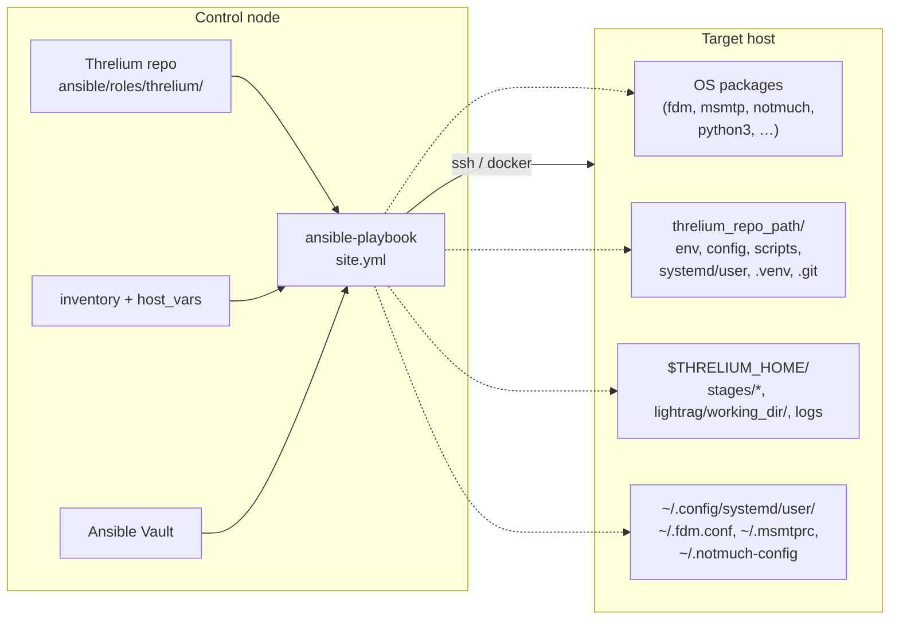

# Threlium — Ansible Playbook: система развёртывания

Архитектурный документ о плейбуке `ansible/playbooks/site.yml` и роли `ansible/roles/threlium/`. Не руководство по Ansible и не описание кода — **зачем** плейбук нужен, из чего состоит, какие инварианты поддерживает.

**Главный тезис.** Плейбук — механизм **bootstrap-инсталляции**: код, конфиги и unit-файлы раскладываются на target push-моделью с control node, **без `git clone` проекта на target**. После успешного bootstrap плейбук выходит из контура сопровождения: источник правды — **локальный git** в `threlium_repo_path` на самом target'е, дальнейшая эволюция (правки оператора, агентские коммиты через `cli_exec`) идёт там. Ansible хост **не обслуживает** ([`ARCHITECTURE.md §1.2`](ARCHITECTURE.md#12-жизненный-цикл-хоста-bootstrap-через-ansible-и-автономная-эволюция)).

**Узкие теги Ansible:** полный контур — **`deploy`**; узкий режим — **`refresh`** (см. §12A). При ``--tags refresh`` в ``site.yml`` выполняется цепочка **`deploy` + `refresh`** (синхронизация ``scripts/``, ``env``, шаблонов unit-ов с control node; **без** ``pip``/venv — это только полный **deploy**); в ``tasks/refresh.yml`` — пролог (fallback фактов) и **`never` + `refresh`** (чистка harness). В операторской доке достаточно имён **deploy** и **refresh**.

**Источники истины.**

| Документ                                   | Зона ответственности                                                                                                 |
| ------------------------------------------ | -------------------------------------------------------------------------------------------------------------------- |
| [ARCHITECTURE.md](ARCHITECTURE.md)         | §1.2 — жизненный цикл хоста; §1.3 — политика e2e-тестирования; §2.7 — общий контур IaC.                              |
| [INDEX.md](INDEX.md)                       | Master-контракт ([`INDEX.md`](INDEX.md)): durable stage Maildirs, union notmuch index, `nm_settle()`, обработка ошибок worker/bridge (§5.6), RAG-loop LightRAG в `threlium-engine` (§5b/§7). Плейбук материализует именно эту модель. |
| [MESSAGES.md](MESSAGES.md)                 | Раскладка `$THRELIUM_HOME`, имена файлов в Maildir, fdm.conf (`match` + `pipe` → `notmuch insert…`), stage submit и RAG-loop.         |
| [ORCHESTRATION.md](ORCHESTRATION.md)       | Контракт fdm (`notmuch insert && threlium-dispatch.sh`) → `threlium-dispatch.sh` → `threlium.runners.engine_submit` / `threlium.runners.engine` + `threlium-sweep@` backstop; LightRAG — **внутри** `threlium-engine`. Плейбук материализует эти unit-ы. |
| [SUBAGENT_TABLE.md](SUBAGENT_TABLE.md) / [MEMORY_TABLE.md](MEMORY_TABLE.md) | Правила роутеров и переходов памяти; плейбук раскладывает реализующие их скрипты.                 |
| [TESTING.md](TESTING.md)                   | e2e-контракт плейбука: Testcontainers + Compose + GreenMail + WireMock (OpenAI HTTP mock).                                                |

---

## 1. Назначение и границы

**Что плейбук делает.** Единственное место, где разнородные слои Threlium (почтовый стек, `notmuch`, `systemd`-оркестрация, Python-код FSM, LightRAG, LLM-клиент) согласованно собираются на конкретном хосте:

- материализует каталог артефактов `threlium_repo_path` с кодом, конфигами и unit-файлами (из `files/`, `templates/` роли);
- создаёт корень данных `$THRELIUM_HOME` (durable Maildir'ы стадий из `threlium_fsm_mailbox_stages`, общий `lightrag/working_dir/` и `notmuch database.path = {{ threlium_home }}/stages`; **отдельного `archive/Maildir` больше нет**, см. [`INDEX.md` §1](INDEX.md#1-motivation));
- разводит симлинки в ожидаемые системой пути (`~/.config/systemd/user/`, `~/.fdm.conf`, `~/.msmtprc`);
- поднимает `systemd --user`-манифест стадий FSM (`threlium-engine.service`, `threlium-work@.service` + `threlium-sweep@.service`, `threlium-dispatch.sh` из fdm `insert && dispatch`) и вспомогательных сервисов (`threlium-bridge@…` при включённых каналах);
- выполняет **acceptance** — сквозную самопроверку завершённости деплоя.

Любой слой можно поднять вручную; **согласованность между ними** (стадии ↔ [SUBAGENT_TABLE.md](SUBAGENT_TABLE.md), unit-ы ↔ [ORCHESTRATION.md](ORCHESTRATION.md), Maildir-раскладка ↔ [MESSAGES.md](MESSAGES.md)) гарантируется только плейбуком.

**Что плейбук *не* делает.**

- **Не клонирует репозиторий** на target — `git clone` из интернета отсутствует; target получает только файлы, материализуемые из роли.
- **Не обслуживает жизненный цикл** после bootstrap. Правки живут в локальном `git` в `threlium_repo_path`, не раскатываются новым прогоном и не синхронизируются обратно. Дополнительно к полному прогону см. §7.2 (**deploy** / **refresh**).
- **Не устанавливает Threlium как пакет.** Корневой `pyproject.toml` репозитория — dev-only для control node. Runtime-зависимости target'а — в отдельном `pyproject.toml`, выкладываемом из шаблона (§4.2.11, §7.6).
- **Не занимается secret management.** Секреты приходят через Ansible Vault / `host_vars` / `-e`; плейбук только шаблонизует их в конфиги с правами `0600` и `no_log: true`.
- **Не реализует бизнес-логику FSM.** Логика — в Python-пакете `scripts/threlium/` (модули стадий — `threlium/states/*.py`, мосты — `threlium/bridges/*.py`), плейбук только копирует их на target и ставит пакет `pip install -e`; контракт — в [SUBAGENT_TABLE.md](SUBAGENT_TABLE.md) и [MEMORY_TABLE.md](MEMORY_TABLE.md).

**Повторный прогон** на уже развёрнутом хосте — это bootstrap другого хоста, **disaster-recovery** на том же (полное перераскатывание, затирает локальный `.git`), либо узкий режим ``--tags refresh`` (синхронизация артефактов агента с control node + harness, §12.2). «Штатной раскаткой правок кода» повторный прогон не является.

**Единственный quality gate плейбука — e2e-тесты** ([TESTING.md](TESTING.md)). Это тест bootstrap-контракта, не «жизни» хоста после деплоя. Unit-тестов на задачи плейбука нет (политика [`ARCHITECTURE.md §1.3`](ARCHITECTURE.md#13-политика-тестирования)).

---

## 2. Ключевые архитектурные решения

| Решение                                        | Смысл                                                                                                                                                                                                                  |
| ---------------------------------------------- | ---------------------------------------------------------------------------------------------------------------------------------------------------------------------------------------------------------------------- |
| **Push-deploy без клонирования**               | Артефакты попадают на target через `copy`/`template` из роли. Локальный `git init` в `threlium_repo_path` — рабочий репозиторий установки (§8).                                                                        |
| **Декларативная идемпотентность: (A) ставим, (B) перетираем** | Два закона: (A) apt/pip/внешний CLI — `install if missing`; (B) код стадий, unit-файлы, шаблоны, симлинки Threlium — перезаписываются каждый прогон. Полная детализация — §2.1.                                |
| **Один каталог артефактов**                    | `threlium_repo_path` — единственный корень; ничего не расползается по `/opt`, `/var`, `/usr/local`. Снаружи — только симлинки на файлы внутри.                                                                         |
| **Артефакты vs данные**                        | `threlium_repo_path` — артефакты (код, конфиги, unit-ы, `.venv`, `.git`); `$THRELIUM_HOME` — данные (durable стадийные Maildir'ы под единым union notmuch root'ом `stages/`, `lightrag/working_dir/`, логи). Независимые корни, не «второе место установки». |
| **`systemd --user` без root-оркестрации**      | Оркестрация идёт через `systemd --user`. `loginctl enable-linger` — единственная root-задача после bootstrap.                                                                                                           |
| **Единый `.venv`**                             | `{{ threlium_venv_path }}/bin/python` — общий интерпретатор всех скриптов и CLI. `virtualenv_command: {{ threlium_system_python_bin }} -m venv` (дефолт `/usr/bin/python3` из метапакета `python3`).                                                                                    |
| **Секреты — в Vault / `host_vars`**            | В роли — только шаблоны с `{{ vault_* }}` и `no_log: true`. Instance-мосты включаются только при достаточном наборе секретов (см. `site.yml`, `set_fact` bridge readiness).                                                                               |
| **Жизненный цикл — не зона плейбука**          | Bootstrap нового хоста; узкий тег **refresh** для e2e/harness. Обычные правки — локальный git на target + `cli_exec` агента (§12).                                                                               |
| **Acceptance как часть деплоя**                | Плейбук не завершает bootstrap, пока не убедился: все стадийные Maildir'ы из `threlium_maildir_rel_paths` есть, unit-ы (`threlium-engine.service`, `threlium-work@.service`, `threlium-sweep@.service`) загружены, `threlium-dispatch.sh` на месте и `~/.fdm.conf` вызывает его после `notmuch insert`, `notmuch` открывается на `database.path = {{ threlium_home }}/stages`, `env/threlium.env` содержит `THRELIUM_HOME`, Python компилируется, `fdm` исполняем, `ExecStart` FSM-юнитов указывает на `python -m threlium.runners.*` (§10). |
| **Один источник стадий**                       | Канон FSM-стадий — **только** `ansible/roles/threlium/vars/main.yml` (`threlium_fsm_mailbox_stages`). Все задачи — `loop` по нему; рассинхронизация невозможна.                                                         |

### 2.1. Текущее поведение повторного прогона и его границы

«Плейбук перетирает прошлое состояние актуальным» — не тотальное утверждение. Плейбук явно разделяет два класса операций:

| Класс                                           | Смысл для Ansible                                                                          | Поведение на повторе                                                                 |
| ----------------------------------------------- | ------------------------------------------------------------------------------------------ | ------------------------------------------------------------------------------------ |
| **(A) Внешние зависимости** (apt, pip, CLI)     | Пакеты из внешних реестров, результаты сторонних CLI (исторически — `graphrag init`; сейчас `lightrag-hku` — pip-пакет, без CLI-bootstrap'а корня, см. [`INDEX.md` §11.1](INDEX.md#111-зависимости-target)). | Штатная идемпотентность Ansible: `state: present` — «install if missing». Это **правильное** поведение для внешних ресурсов. |
| **(B) Артефакты Threlium**                      | Код стадий, скрипты, unit-файлы, шаблонизируемые конфиги, симлинки. Источник — текущий репо. | **Перетирание:** каждая задача сравнивает содержимое target'а с репо и перезаписывает при расхождении, без `creates:` / `when: not stat.exists`. |

«Декларативная идемпотентность» из §2 относится к классу **(B)**. Тот факт, что apt-пакет уже стоит — не нарушение инварианта, а желаемое поведение (A).

#### 2.1.1. Класс (B): что перетирается

Повторный прогон `site.yml` доводит эти артефакты до актуального состояния даже в уже запечённом baked-образе:

- **Env-файлы и конфиги** (`template`, `force: yes`): `env/threlium.env`, `config/{fdm.conf,msmtprc,threlium.yaml}`, `~/.notmuch-config` (`database.path = {{ threlium_home }}/stages`, [`INDEX.md` §1](INDEX.md#1-motivation)).
- **Systemd user-юниты**: шаблоны `threlium-engine.service.j2`, `threlium-work@.service.j2` + `threlium-sweep@.service.j2`, **`threlium-bridge@.service.j2`**. Dispatch-скрипт `threlium-dispatch.sh` и терминирующие ветки `~/.fdm.conf` (`notmuch insert && …/threlium-dispatch.sh`) — шаблоны для оркестрации вместо прежних `threlium-stage@.{path,service}`. **`threlium-archive.{path,service}` удалён** — его роль распределена между fdm (`pipe` → `notmuch insert…`, [`INDEX.md` §4](INDEX.md#4-mailfilter-terminating-insert)) и **RAG-loop в `threlium-engine`** ([`INDEX.md` §5b](INDEX.md#5b-lightrag-worker)). Шаблонов `threlium-lightrag@*.path` / `threlium-lightrag.service` в роли нет.
- **Python-код Threlium** (`copy` + `pip install -e`): весь пакет `scripts/threlium/` (модули `common`, `delivery` (вызов `fdm`), `nm` (helper `nm_settle()`, [`INDEX.md` §5.5.3](INDEX.md#553-notmuch-consistency-через-notmuch2mutabletagset)), `cli_fsm`, подпакеты `runners/` (`engine/` — сокет + FSM + universal errors — [`INDEX.md` §5.6](INDEX.md#56-universal-error-handling-в-runnersworkerpy)), `states/` и `bridges/`) и `scripts/pyproject.toml`. После копирования выполняется editable-install пакета в `.venv`, так что модули стадий доступны для импорта движком (`python -m threlium.runners.engine`, см. [ORCHESTRATION.md §6](ORCHESTRATION.md#6-юниты-systemd-пути-имена-окружение)).
- **Симлинки** (`file: state=link, force: true`): `~/.fdm.conf`, `~/.msmtprc`, все юниты в `~/.config/systemd/user/`.
- **`daemon-reload`** — на шаге «Enable and start systemd user units», после перезаписи шаблонов.

Новые задачи класса (B) пишут файл так, чтобы повтор доводил target до текущего состояния репо даже при старом baked. Конструкции `creates:` / `when: not stat.exists` / маркерные файлы для (B) **запрещены** — через baked они превращаются в зашитый T₀.

#### 2.1.2. Класс (B): что перетиранию не подлежит

Три редких исключения с `creates:` / `force: false`:

- **Локальный `.git` в `threlium_repo_path`.** `creates: .git` → на повторе пропускается. Инвариант §8 / §12: локальная история правок оператора и агентских коммитов через `cli_exec` не должна стираться.
- **Физическая раскладка durable Maildir'ов** (модуль `file`: `cur`/`new`/`tmp` под каждым `stages/<id>/Maildir`). Каждый стадийный Maildir под `stages/<id>/` — durable canonical event-store этой стадии (после `nm_settle()` файлы оседают в `cur/<id>:2,S` и **не удаляются**, retention отложен — [`INDEX.md` §10.1 future work](INDEX.md#101-future-work-deferred)); пересоздавать опасно для данных. Очистка содержимого — только в теге **refresh** (`tasks/refresh.yml`, §4.2.17).
#### 2.1.3. Класс (A): штатная идемпотентность, не «ограничение»

Задачи с внешними реестрами идут по логике «install if missing» — это **не** дыра:

- **`apt` — `state: present`.** Новый пакет из списка доставится; уже установленный не обновляется. Версии базовой ОС — зона админа, не плейбука.
- **`pip install` runtime-deps.** Новые пакеты ставятся (включая `lightrag-hku`, `notmuch2`, `msgspec`, `pybase62` — [`INDEX.md` §11.1](INDEX.md#111-зависимости-target)), изменившиеся constraints проставляются; уже стоящие не переустанавливаются.
- **LightRAG `working_dir`** инициализируется самим `LightRAG(working_dir=...)` при старте RAG-loop в `threlium-engine` (первый `initialize_storages` / drain); внешнего CLI-bootstrap'а корня нет (историческая операция `graphrag init` удалена вместе с переходом на embedded `lightrag-hku`).

(A) отвечает на «всё ли нужное установлено», (B) — на «соответствует ли Threlium репо». Эти законы разные; попытка навязать (A) perfect-overwrite ломает идемпотентность Ansible без пользы.

#### 2.1.4. Известные ограничения — то, что действительно не покрывается ни (A), ни (B)

Явный контракт того, что плейбук **не** обрабатывает автоматически:

1. **Удалённые из репо файлы не вычищаются с target'а.** `copy`/`template` не поддерживают purge-семантику. Удалённый модуль стадии или unit-шаблон останется в `threlium_repo_path/scripts/threlium/states/` или `threlium_repo_path/systemd/user/`; во втором случае его залинкует общий шаг symlink'ов в `~/.config/systemd/user/` (как «loaded, disabled»). Для быстрых e2e удаление стадии не проверяется. В `pytest -n0 tests/e2e/wipe_bake.py` проблемы нет — baked печётся из голой Ubuntu. В проде: удаление стадии/юнита = повод для `wipe_bake` / осознанного disaster-recovery.
2. **Долгоживущие сервисы не рестартуются основным прогоном, если unit не менялся.** `state: started`, не `restarted`. Правка только **кода** Python-скрипта, к которому обращается бридж (`threlium-bridge@*.service`), не заставит systemd рестартовать процесс — старый код живёт в памяти до ручного `systemctl --user restart`. FSM submit (`threlium-work@`, `Type=exec`) каждый раз — новый процесс. В e2e закрыто тегом **refresh** (`daemon-reload` + `state: restarted`). В проде после disaster-recovery — бриджи рестартовать вручную.
3. **Апгрейды внешних зависимостей и смены их defaults не доезжают сами — граница класса (A).** Новая apt-версия — зона админа. Более строгий pip-constraint — проставится; удаление пакета из списка — нет (§2.1.3). Смена несовместимой on-disk схемы графа в новой версии `lightrag-hku` — требует `pytest -n0 tests/e2e/wipe_bake.py` на чистом `lightrag/working_dir/`.

#### 2.1.5. Рабочая модель для оператора

| Что поменялось в репо                                                          | Класс         | Что делать                                                                                                                     |
| ------------------------------------------------------------------------------ | ------------- | ------------------------------------------------------------------------------------------------------------------------------ |
| FSM-скрипты, шаблоны юнитов, конфиги, env-значения                             | (B)           | e2e: `pytest` — baked переиспользуется, `site.yml` перетирает. Прод: локальный git + `cli_exec`, **не** новый `site.yml` (§12). |
| Удалена стадия или шаблон юнита                                                | (B) + §2.1.4.1 | `pytest -n0 tests/e2e/wipe_bake.py`. Прод: disaster-recovery с предварительной ручной очисткой.                                                |
| Добавлен apt-пакет, изменён pip-constraint, новая тяжёлая задача в роли         | (A) + новая (B)-задача | `pytest -n0 tests/e2e/wipe_bake.py`. Прод: disaster-recovery или точечная установка.                                                   |
| Правка кода бриджа, unit не менялся                                            | (B) + §2.1.4.2 | e2e: `pytest` (harness форс-рестартует). Прод: `site.yml` + ручной `systemctl --user restart threlium-bridge@<chan>.service`.      |
| Смена версии `lightrag-hku` с несовместимыми изменениями on-disk схемы графа    | (A) + §2.1.4.3 | `pytest -n0 tests/e2e/wipe_bake.py` (на чистом `lightrag/working_dir/`).                                                                       |
| Добавление нового канала / новой стадии без правки существующих                | (B) точечно   | Полный прогон `site.yml` (**deploy**) после правок роли / inventory (§7.2, §12).                                      |

---

## 3. Push-модель: control node → target



- **Control node** — единственный источник правды на bootstrap (клон этого репо + Vault). Правки делаются здесь, отсюда и доезжают.
- **Target** — «тонкий» хост: OS-пакеты + `threlium_repo_path` + `$THRELIUM_HOME` + user-systemd. Сам обновления не подтягивает.
- **Симметрия.** «Клон на control node есть» и «target не клонирует» — не противоречие: Ansible нужен source tree, чтобы разобрать его по `copy`/`template`.
- **Транспорт.** Прод — `ssh`; e2e — `docker` (`ansible_connection: docker`, контейнер `sut`, см. [ansible/README.md](../ansible/README.md)).

---

## 4. Структура плейбука

### 4.1. Раскладка файлов

```text
ansible/
  ansible.cfg                 # прод: без skip_tags; чистка harness — never+refresh
  ansible-e2e.cfg             # e2e: collections_path = ./collections
  collections/                # community.docker, community.general
  inventory/{hosts.yml, e2e/hosts.yml}
  group_vars/{all.yml(.example), e2e.yml}
  playbooks/
    site.yml                  # единственный сценарий
    tasks/refresh.yml         # deploy+refresh (пролог) и never+refresh (чистка)
  roles/threlium/
    defaults/main.yml         # дефолтные переменные (§7)
    vars/main.yml             # канон FSM-стадий
    files/
      scripts/                # Python FSM + bash-оркестрация
      env/                    # статические env-заготовки
    templates/
      env/threlium.env.j2
      config/{fdm.conf,msmtprc,threlium.yaml,notmuch-config}.j2
      systemd/user/*.j2
      pyproject.toml.j2
  artifacts/                  # post-deploy bundle на control node
```

**Почему задачи в `playbooks/site.yml`, а не в `roles/threlium/tasks/`.** Текущий `site.yml` короткий и читается как последовательный сценарий; перенос в роль дал бы `include_role` с тем же числом строк и сломал бы относительные пути `{{ playbook_dir }}` в `copy: src=…`. Это осознанная граница, не «роль без tasks».

### 4.2. Порядок задач в `site.yml`

Каждая фаза — предусловие для следующей.

| #        | Фаза                              | Цель                                                                                                                                   |
| -------- | --------------------------------- | -------------------------------------------------------------------------------------------------------------------------------------- |
| 4.2.1    | Assert обязательных переменных    | Провалить прогон **до** изменений на target при пустых `threlium_repo_path`/`threlium_home`/`threlium_user`. Секреты опциональны: instance-мосты включаются только при достаточном наборе полей (см. `set_fact` bridge readiness в `site.yml`). |
| 4.2.2    | Bootstrap ОС (apt)                | `fdm`, `msmtp(-mta)`, `notmuch`, `curl`, `git`, `python3`, `python3-venv`, `python3-pip`. |
| 4.2.3    | Assert mail-stack                 | `/usr/bin/fdm` и системный интерпретатор для venv (`threlium_system_python_bin`) исполняемы.                                                                                  |
| 4.2.4    | Каталог артефактов                | `threlium_repo_path/` + подкаталоги. Идемпотентный `git init` (`creates: .git`) — рабочий локальный репо установки (§8).                 |
| 4.2.5    | Раскладка `$THRELIUM_HOME`        | `file` для `logs/`, `lightrag/working_dir/`, `stages/` и т.д. Стадийные Maildir'ы — `file` на `cur`/`new`/`tmp` по `threlium_maildir_rel_paths` из `vars/main.yml` (**нет** `archive/Maildir`).         |
| 4.2.6    | Выкладка кода FSM                 | `copy` Python-пакета `threlium/` (включая `threlium.runners.engine`, `threlium.runners.engine_submit` — [`INDEX.md` §5.6](INDEX.md#56-universal-error-handling-в-runnersworkerpy), `threlium.nm` с `nm_settle()` — [`INDEX.md` §5.5.3](INDEX.md#553-notmuch-consistency-через-notmuch2mutabletagset)) + dispatch-скрипт `threlium-dispatch.sh`. |
| 4.2.7    | Шаблонизация конфигов             | `template` env/config-файлов (`threlium.env`, `threlium.yaml`, `fdm.conf`, `msmtprc`), с `no_log: true` на секретах. `fdm.conf` — `match` + `pipe` на `notmuch insert --folder=<stage>/Maildir [+route|+error] && …/threlium-dispatch.sh`; else: `remove-header`/`add-header` + тот же `pipe` ([`INDEX.md` §4](INDEX.md#4-mailfilter-terminating-insert), [`MESSAGES.md` §3](MESSAGES.md#3-mailfilter-snippet)). |
| 4.2.8    | Шаблонизация unit-файлов          | `threlium-engine.service.j2`, template-юниты `threlium-work@.service.j2` + `threlium-sweep@.service.j2`, **`threlium-bridge@.service.j2`**; `threlium-dispatch.sh`. Шаблонов `threlium-lightrag*` в роли нет ([`INDEX.md` §6](INDEX.md#6-systemd-units)). |
| 4.2.9    | Симлинки в `$HOME`                | `~/.config/systemd/user/<unit>` → репо; `~/.fdm.conf`, `~/.msmtprc` → шаблонизованные конфиги.                                        |
| 4.2.10   | `notmuch-config`                  | `~/.notmuch-config` с **`database.path = {{ threlium_home }}/stages`** (единый union root над всеми стадийными Maildir'ами; [`INDEX.md` §1](INDEX.md#1-motivation)). Индекс создаётся acceptance'ом (`notmuch new`).      |
| 4.2.11   | Venv и Python-зависимости         | `templates/pyproject.toml.j2` → `threlium_repo_path/pyproject.toml` (**единственное** декларативное место runtime-deps target'а: `lightrag-hku`, `notmuch2`, `pybase62`, `msgspec`, `litellm`, …; [`INDEX.md` §11.1](INDEX.md#111-зависимости-target)). Venv через `ansible.builtin.pip`; установка — `pip install .` из этого каталога. Dev-`pyproject.toml` корня репо на target **не** попадает. |
| 4.2.12   | LightRAG working_dir              | `mkdir` `{{ threlium_lightrag_working_dir }}` (`lightrag/working_dir/` под `$THRELIUM_HOME`). Граф поднимается RAG-loop в `threlium-engine`; внешнего CLI-bootstrap'а нет. |
| 4.2.13   | `loginctl enable-linger`          | User-manager без логина. Единственная `become: true` после bootstrap ОС.                                                                 |
| 4.2.14   | `daemon-reload` + enable/start    | `ansible.builtin.systemd` с `scope: user`, `daemon_reload: true`, `state: started` для юнитов из `site.yml` (`threlium-engine`, мосты, …). |
| 4.2.15   | Acceptance                        | Сквозная самопроверка (§10).                                                                                                            |
| 4.2.16   | Post-deploy bundle                | Штатный шаг: `tar.gz` на target → `fetch` на control node. Отключается `threlium_bundle_enabled=false` (в e2e так по умолчанию). См. §11. |
| 4.2.17   | `refresh` (см. §12A)             | ``--tags refresh``: цепочка ``deploy``+``refresh`` в ``site.yml`` (код, env, шаблоны; **без** ``pip``) + ``never``+``refresh`` в ``tasks/refresh.yml`` (сброс Maildir/notmuch/LightRAG, рестарт user-units). HTTP-mock OpenAI тегом **не** поднимается — compose-сервис `wiremock` ([TESTING.md §4.4](TESTING.md#44-wiremock-openai-http-mock-e2e)). |

Очистка Maildir в `tasks/refresh.yml` — один вызов GNU `find` с несколькими корнями и `-delete` (целевой target — Debian/Ubuntu; BusyBox-find не поддерживается). Сброс почты и `notmuch new` выполняются от `threlium_user`, симметрично владению данными.

**Почему assert в самом начале по пользователю.** Ansible делает «всё или ничего» при ошибке — но **после** изменений: `apt` уже поставил пакеты, `file` создал каталоги. Первый assert по `threlium_user` гарантирует прерывание прогона **до** любых side-effect'ов на target.

---

## 5. Карта артефактов на target

После успешного прогона — ровно четыре зоны. Ничего не расползается по системе.

| Зона                           | Что лежит                                                                                                                                                     | Владелец                    |
| ------------------------------ | ------------------------------------------------------------------------------------------------------------------------------------------------------------- | --------------------------- |
| `threlium_repo_path/`          | `pyproject.toml` (runtime-deps), `env/`, `config/`, `scripts/`, `systemd/user/`, `.venv/`, локальный рабочий `.git` (история эволюции установки, §8, §12). | `threlium_user` (0755/0600) |
| `$THRELIUM_HOME/`              | `stages/<id>/Maildir/` (durable event-store) + `lightrag/working_dir/` + `logs/`. Полная раскладка и состав — [`MESSAGES.md` §1](MESSAGES.md#1-раскладка-хранения). | `threlium_user` (0755) |
| `~/`                           | `~/.notmuch-config` (0600, файл), `~/.fdm.conf` / `~/.msmtprc` — **симлинки**.                                                                                | `threlium_user`             |
| `~/.config/systemd/user/`      | Симлинки на каждый `*.path`/`*.service`/`*.timer` из `threlium_repo_path/systemd/user/`.                                                                       | `threlium_user`             |

**Инвариант симлинков.** Все unit-файлы и почтовые конфиги в `$HOME` — симлинки на репо-каталог:

- правка в репо видна `systemctl --user daemon-reload` без перекладки симлинков;
- `cat ~/.config/systemd/user/threlium-enrich.path` проверяет «какую версию видит systemd»;
- удаление `threlium_repo_path` оставляет битые симлинки — **намеренно**: видно, что установка сломана.

**Инвариант «стадии ↔ `vars/main.yml`».** Все задачи по стадиям — циклы по `threlium_fsm_mailbox_stages`, не статические списки. Новая стадия = строчка в `vars/main.yml`, плейбук подхватывает автоматически.

---

## 6. `systemd --user`: что именно выкладывается

Плейбук — единственное место, где определяется, **какие** unit-ы существуют. Контракт самих unit-ов — [`ORCHESTRATION.md §§3, 5`](ORCHESTRATION.md#3-механизм-post-insert-hook--dispatch-script) и [`MESSAGES.md §5.1`](MESSAGES.md#51-stage-worker-тригер-lifecycle-контракт); здесь не дублируется.

| Группа                           | Выкладываются                                                                                                              | Источник шаблона                                                                     |
| -------------------------------- | -------------------------------------------------------------------------------------------------------------------------- | ------------------------------------------------------------------------------------ |
| **FSM-стадии** (dispatch + воркер + sweep) | fdm (`notmuch insert && threlium-dispatch.sh`) → `threlium-dispatch.sh` (notmuch query `tag:unread AND folder:<stage>/Maildir` → `systemctl start --no-block threlium-work@<stage>:<thread_id>.service`; воркер — `to:<stage>@localhost` + `thread:`); один шаблон `threlium-work@.service` (инстансы `threlium-work@<stage>:<thread_id>.service`, обработка ошибок — [`INDEX.md` §5.6](INDEX.md#56-universal-error-handling-в-runnersworkerpy)); один шаблон `threlium-sweep@.service` (backstop после **`exit 0`** воркера через **`OnSuccess=`**). | `threlium-work@.service.j2`, `threlium-sweep@.service.j2`, `threlium-dispatch.sh.j2`, `config/fdm.conf.j2` |
| **RAG-loop (в `threlium-engine`)** | Индексация LightRAG и `aquery` для enrich — внутри `threlium-engine.service` ([`INDEX.md` §5b](INDEX.md#5b-lightrag-worker)). Отдельных `threlium-lightrag@*.path` / `threlium-lightrag.service` нет. **`threlium-archive.{path,service}` удалён** — его роль распределена между fdm и движком. | *(в составе `threlium-engine.service.j2` + код `runners/lightrag.py`)* |
| **Мосты каналов** (при `email` / флагах TG/MX) | Инстансы `threlium-bridge@email.service` и т.д.; `EnvironmentFile=-…/env/threlium.env`. | `templates/systemd/user/threlium-bridge@.service.j2` |
| **Slice**                         | `threlium-work.slice` — `TasksMax` / `MemoryMax` / `CPUQuota`. Механизм — [`ORCHESTRATION.md §5`](ORCHESTRATION.md#5-гонки-восстановление-лимит-параллелизма). | drop-in / template                                                              |

**Enable/start** делается один раз на bootstrap (фаза 4.2.14). `state: restarted` не делается: рестарт после правки шаблона — зона эксплуатации (в том числе `cli_exec`, §12), не плейбука. Ограничение 2 из §2.1.4 — именно про это.

**`EnvironmentFile` единый.** Все unit-ы подгружают `-{{ threlium_repo_path }}/env/threlium.env` (минус = не падать, если файла нет — защита для первичного bootstrap). Отдельных `bridge-*.env` больше нет — все параметры мостов определяются в `threlium.yaml` через `ThreliumSettings`.

---

## 7. Переменные плейбука

**Приоритет** (стандартный Ansible): `host_vars/<host>.yml` > `group_vars/<group>.yml` > `roles/threlium/defaults/main.yml`. Поверх — `-e 'var=value'` / `-e @file.yml`.

**Канон стадий** — [`ansible/roles/threlium/vars/main.yml`](../ansible/roles/threlium/vars/main.yml); производные `threlium_fsm_stage_ids` / `threlium_maildir_rel_paths` вычисляются там же. Из `group_vars` переопределять бессмысленно.

### 7.1. Пути и пользователь

| Переменная                    | Назначение / дефолт                                                                                |
| ----------------------------- | -------------------------------------------------------------------------------------------------- |
| `threlium_user`               | Пользователь linger / симлинков / user-systemd. Дефолт: `threlium` (`defaults/main.yml`). |
| `threlium_repo_path`          | Код агента. Дефолт после getent: `{{ threlium_bundle_root }}/agent`; override в `host_vars` / `-e`. |
| `threlium_home`               | `$THRELIUM_HOME` (данные). Дефолт после getent: `{{ ansible_facts.getent_passwd[threlium_user][4] }}/threlium/data`. |
| `threlium_systemd_user_dir`   | Симлинки user units. Дефолт: `{{ threlium_posix_home }}/.config/systemd/user`. |

**Факты Ansible:** `inject_facts_as_vars` не отключаем (дефолт ansible-core). В play/tasks/Jinja для setup-фактов — `ansible_facts['distribution_release']`, `ansible_facts['date_time']`, `ansible_facts['env']`, не top-level `ansible_*` (deprecation). Пути агента — только через `getent` + `ansible_facts.getent_passwd`, не `ansible_facts['env'].HOME` (это HOME SSH-сессии, часто root).

### 7.2. Каналы и секреты

`threlium_channels` — подмножество `['email', 'telegram', 'matrix']`. Шаблоны и артефакты почтового стека раскладываются при полном прогоне (**deploy**). Instance-мосты (`threlium-bridge@…`) **enable/start** только если для канала задан минимальный набор секретов (логика в `site.yml`, `set_fact` для bridge readiness); без секретов деплой завершается без включения соответствующего моста.

Добавление канала или секретов на живой хост без полной перезаписи локального git — по-прежнему зона §12.1 (локальные правки) или осознанный полный прогон `site.yml` (**deploy**) как disaster-recovery.

### 7.3. Входящая почта (IMAP bridge)

| Переменная                      | Назначение                                                                  |
| ------------------------------- | --------------------------------------------------------------------------- |
| `threlium_fetchmail_host/user/pass` | IMAP-сервер, учётка, пароль (Vault). Имена сохранены для обратной совместимости inventory; прокидываются в `threlium.yaml` через пространство `threlium_bridges_email_*`. |
| `threlium_fetchmail_imap_port`  | Порт IMAP (993 SSL / 143 plain); пусто — протокольный default.              |
| `threlium_fetchmail_tls`        | `true` → `MailBox` (IMAPS); `false` → `MailBoxUnencrypted`. Дефолт `true`. |
| `threlium_imap_ssl_verify`     | Дефолт `1` (роль); в e2e для self-signed GreenMail без CA в trust — `0` (`bridges.email.imap_ssl_verify` в `threlium.yaml`). |

**Unit-специфика:** `Restart=on-failure`, `RestartSec=1s`, `[Unit]` `StartLimitIntervalSec=0` (мост).

### 7.4. Исходящая почта (msmtp)

`threlium_msmtp_host/port/tls/auth/from/user/pass`.

### 7.5. Мосты

| Переменная                         | Назначение                                                  |
| ---------------------------------- | ----------------------------------------------------------- |
| `threlium_bridge_telegram_enabled` | Выкладывать Telegram-мост (`false` по умолчанию).            |
| `threlium_bridge_matrix_enabled`   | Выкладывать Matrix-мост (`false` по умолчанию).              |
| `threlium_telegram_bot_token`      | Нужен для enable/start Telegram-моста (шаблон вместе с флагом и секретом).                            |
| `threlium_matrix_homeserver/user/token` | Параметры Matrix при включённом мосте и непустых полях.                                       |

### 7.6. Python, venv, LightRAG

| Переменная                          | Назначение                                                                                              |
| ----------------------------------- | ------------------------------------------------------------------------------------------------------- |
| `threlium_venv_path`                | Единый venv. Дефолт `{{ threlium_repo_path }}/.venv`. Создаётся `pip` модулем с `virtualenv_command: {{ threlium_system_python_bin }} -m venv` (роль: `defaults/main.yml`). |
| `threlium_system_python_bin`       | Путь к системному `python3` для `venv` (дефолт `/usr/bin/python3`; метапакеты `python3` / `python3-venv` в apt). |
| `threlium_lightrag_working_dir`     | On-disk корень общего LightRAG-графа. Дефолт `{{ threlium_home }}/lightrag/working_dir`. Single-writer-доступ — из процесса `threlium-engine` ([`INDEX.md` §5b](INDEX.md#5b-lightrag-worker)); `enrich` вызывает `aquery` на том же инстансе через `run_rag_coroutine`. |

apt-пакеты `python3`, `python3-venv` и `python3-pip` ставятся в фазе 4.2.2; assert проверяет `python3` ≥ 3.11. Unit-файлы используют литерал `{{ threlium_venv_path }}/bin/python`.

**Runtime-зависимости — отдельный `pyproject.toml` на target.** Полный список (`lightrag-hku`, `litellm`, `notmuch2`, `pybase62`, `msgspec`, …; [`INDEX.md` §11.1](INDEX.md#111-зависимости-target)) — в `templates/pyproject.toml.j2` → `{{ threlium_repo_path }}/pyproject.toml`, установка `pip install .` внутри venv. Это делает target-список **явным артефактом** (виден в локальном git, в bundle, сравним между хостами), разводит dev/runtime (корневой `pyproject.toml` репо — только control node) и позволяет агенту через `cli_exec` править `pyproject.toml` + `pip install .` декларативно, не через `pip install <pkg>==…` руками.

### 7.7. Reasoning / LLM

`threlium_reasoning_model`, `threlium_reasoning_timeout_sec`, `threlium_lightrag_embedding_timeout_sec` (в шаблон `config/threlium.yaml.j2` — таймауты и маршрутизация LLM через `ThreliumSettings`), `threlium_openai_api_base`, `threlium_openai_api_key`. Модель и прочие ключи — в `threlium.yaml`; `OPENAI_API_KEY`/`LITELLM_API_KEY` при необходимости — в окружение пользователя или systemd drop-in.

### 7.8. FSM-стадии

| Переменная                        | Назначение                                                                                |
| --------------------------------- | ----------------------------------------------------------------------------------------- |
| `threlium_fsm_mailbox_stages`     | Канон `{ id }` в `vars/main.yml` — список идентификаторов FSM-стадий; модуль handler'а — `states/<id>.py` (см. [`MESSAGES.md` §5](MESSAGES.md#5-stage-worker-и-lightrag-worker)). |
| `threlium_fsm_stage_ids`          | Список имён стадий из `threlium_fsm_mailbox_stages` для производных задач (Maildir-пути и т.д.). Отдельных systemd-инстансов `threlium-lightrag@*` нет. |
| `threlium_maildir_rel_paths`      | `stages/<id>/Maildir` для каждой стадии из `threlium_fsm_mailbox_stages` — для создания `cur`/`new`/`tmp` в `site.yml` и acceptance. **`archive/Maildir` исключён** (union notmuch root = `stages/`, отдельного архива нет). |

Новая запись в `threlium_fsm_mailbox_stages` подтягивается при следующем полном прогоне **deploy** (`site.yml`): создаются Maildir-пути, обновляются шаблоны `fdm.conf` и dispatch. Правки поведения соседних стадий (роутеры, память) остаются зоной локального git на target (§12.1).

### 7.9. systemd-лимиты

`threlium_path_trigger_limit_*` зарезервированы под возможные будущие `.path`-юниты; для LightRAG отдельных path-юнитов нет ([`INDEX.md` §6](INDEX.md#6-systemd-units)).

### 7.10. Post-deploy bundle

После acceptance плейбук **по умолчанию** собирает `tar.gz` на target и скачивает его на control node — нормативный способ сохранить снимок установки. Тот же механизм — в e2e: при падении на control node остаётся bundle.

| Переменная                            | Назначение                                                                                                              |
| ------------------------------------- | ----------------------------------------------------------------------------------------------------------------------- |
| `threlium_bundle_enabled`             | Включает (`archive` + `fetch` + cleanup). `defaults: true`; [`group_vars/e2e.yml`](../ansible/group_vars/e2e.yml) — `false`. |
| `threlium_bundle_cleanup_remote`      | Удалять `tar.gz` с target после `fetch`.                                                                                 |
| `threlium_bundle_local_dir`           | Каталог на control node (подкаталог `{{ inventory_hostname }}`).                                                         |
| `threlium_bundle_paths`               | Allowlist путей. Дефолт: `threlium_repo_path`, `threlium_home`, `~/.notmuch-config`, `threlium_systemd_user_dir`.        |

Имя: `{{ threlium_home }}/logs/threlium-bundle-{{ inventory_hostname }}-{{ ansible_facts['date_time'].iso8601_basic_short }}.tar.gz`. **Безопасность:** может содержать секреты — для выгрузки в CI сужайте `threlium_bundle_paths`.

### 7.11. Режим e2e (`group_vars/e2e.yml`)

Оверрайды для Docker-SUT: `threlium_fetchmail_host` / `threlium_msmtp_host` — внутренние (`greenmail`); host-порты GreenMail динамические (runtime discovery в `tests/e2e/helpers.py`); `threlium_fetchmail_tls: true` + `threlium_imap_ssl_verify: 0` для self-signed GreenMail cert; `threlium_openai_api_base=http://wiremock:8080` — compose-сервис WireMock ([TESTING.md §4.4](TESTING.md#44-wiremock-openai-http-mock-e2e)); `threlium_bundle_enabled=false`. `e2e_sut_container_id` передаётся через `-e` (используется как `ansible_host` при `ansible_connection=docker`).

### 7.12. Vault

Пароли и токены — через Ansible Vault или `host_vars` в те же `threlium_*`-переменные (`threlium_*_pass = "{{ vault_* }}"` в `group_vars`). Отдельного vault-контракта нет; задачи с секретами — `no_log: true`.

---

## 8. Инвариант: `git clone` проекта на target нет; локальный `git` — есть

«Клонировать репозиторий Threlium на target из интернета» осознанно отвергнуто:

- **Target не обязан иметь доступ в интернет** к Git-remote. Push-модель переживает air-gap.
- **Правда на bootstrap — control node; после — локальный git на target.** Никакого `git pull` в цикле нет.
- **Секреты — в Vault/`host_vars` на control node**, не в публичном Git. Иначе нужен параллельный механизм доставки секретов.
- **e2e через Testcontainers:** `sut` стартует с чистой ФС каждый прогон, без клона. Единственный путь кода — bootstrap через плейбук.

**Локальный `git init`:**

```yaml
- name: Initialize target git repository if missing
  ansible.builtin.command:
    cmd: "git init {{ threlium_repo_path }}"
    creates: "{{ threlium_repo_path }}/.git"
```

Идемпотентная инициализация рабочего репозитория поверх каталога, разложенного плейбуком. После bootstrap именно этот `.git` — источник правды установки: туда коммитятся правки оператора и `cli_exec`-изменения агента (§12). `git remote add` / `git pull` / `git clone` плейбук **не выполняет никогда**.

---

## 9. Секреты и безопасность

- Права `0600`: `env/threlium.env`, `config/{msmtprc,threlium.yaml}`, `~/.notmuch-config`.
- `no_log: true` на задачах с секретами; `fail_msg:` в assert'ах не раскрывает значений.
- Assert обязательных секретов — **до** изменений (§4.2.1).
- **Ansible Vault.** `threlium_*_pass = "{{ vault_* }}"` в `group_vars` — стабильное боевое имя, меняющийся источник.
- **Post-deploy bundle** может содержать секреты — для разбора, не для CI-выгрузки.
- В Git коммитятся **только** `*.example`-шаблоны; реальные env/rc-файлы — на target, в `threlium_repo_path/`.

---

## 10. Acceptance: сквозная самопроверка деплоя

Acceptance — **часть самого деплоя**, не «тесты после». Падение acceptance = деплой не прошёл.

| Проверка                                      | Что гарантирует                                                                                                             |
| --------------------------------------------- | --------------------------------------------------------------------------------------------------------------------------- |
| Mail-stack bins (`stat` + executable)          | `/usr/bin/fdm`, `threlium_system_python_bin` — apt действительно отработал.                                                    |
| `ExecStart` FSM-юнитов                         | `threlium-engine.service` — `python -m threlium.runners.engine` (внутри — RAG-loop, см. [`INDEX.md` §5b](INDEX.md#5b-lightrag-worker)); `threlium-work@.service` — `python -m threlium.runners.engine_submit`; `threlium-sweep@.service` — `threlium-dispatch.sh`; `threlium-dispatch.sh` — notmuch query → batch `systemctl start`. Отдельного `threlium-lightrag.service` нет. |
| Maildir-корни существуют                       | Каждый путь из `threlium_maildir_rel_paths` — каталог.                                  |
| LightRAG `working_dir` существует              | `{{ threlium_lightrag_working_dir }}` — каталог; владелец `threlium_user`; права `0700`.                                       |
| FSM dispatch и worker юниты в репо              | `{{ threlium_repo_path }}/systemd/user/threlium-engine.service`, `threlium-work@.service` и `threlium-sweep@.service` (template-юниты); `threlium-dispatch.sh` (dispatch-скрипт); `config/fdm.conf.j2` задаёт `insert && dispatch` в `~/.fdm.conf`. |
| Aux-юниты                                      | Инстансы **`threlium-bridge@<chan>.service`** (мосты). **`threlium-archive.{path,service}` отсутствует** (роль распределена между fdm и движком — [`INDEX.md` §1, §5b](INDEX.md#1-motivation)).                     |
| Симлинки                                       | `~/.fdm.conf`, `~/.msmtprc`, `threlium-engine.service` / `threlium-work@.service` / `threlium-sweep@.service` / **`threlium-bridge@.service`** — именно симлинки.                    |
| `~/.notmuch-config` + `notmuch new`            | БД открывается и индексируется без ошибок на **`database.path = {{ threlium_home }}/stages`** (union root над всеми стадийными Maildir'ами; [`INDEX.md` §1](INDEX.md#1-motivation)). Selector `notmuch search '*'` возвращает все settled письма.                                          |
| `fdm.conf` валиден                   | `~/.fdm.conf` содержит per-stage `match` + `pipe` на `notmuch insert --folder=<id>/Maildir … && threlium-dispatch.sh` для каждого `id` из `threlium_fsm_mailbox_stages` (bridge→ingress — `+route`; else — `remove-header`/`add-header To:` + `+error`) ([`MESSAGES.md` §3](MESSAGES.md#3-mailfilter-snippet)). |
| Пакет `threlium` (runners + states + nm)        | Скопирован на target и установлен через `pip install -e scripts/`. Обязательно: `threlium.runners.engine`, `threlium.runners.lightrag`, `threlium.nm` (`nm_settle()`). |
| `python -m compileall` на `scripts/`           | Валидный синтаксис в `{{ threlium_venv_path }}/bin/python`.                                                                   |
| `service_facts` + `systemd`-lookup             | `LoadState == loaded` для `threlium-engine`, `threlium-work@.service`, `threlium-sweep@.service`, мостов — `daemon-reload` подхватил unit-файлы.                          |
| `EnvironmentFile=` в каждом `.service`         | Подгружается `-{{ threlium_repo_path }}/env/threlium.env`; единый файл для всех unit-ов (отдельных bridge-env нет). Пути `THRELIUM_HOME` и `THRELIUM_CONFIG` задаются в `env/threlium.env`; остальная конфигурация (включая `lightrag.working_dir`) — в `threlium.yaml` через `ThreliumSettings`. |
| `env/threlium.env` содержит `THRELIUM_HOME=` и `THRELIUM_CONFIG=`  | Без них unit-ы не знают раскладки данных и пути к `threlium.yaml` ([`INDEX.md §1`](INDEX.md#1-motivation), [`MESSAGES.md §1`](MESSAGES.md#1-раскладка-хранения)).                             |

**Отдельный блок в конце** — чтобы повторно дёргать на отладке: `ansible-playbook site.yml --start-at-task="Acceptance — корни Maildir"` без перекладки пакетов.

---

## 11. Post-deploy bundle

После acceptance плейбук **по умолчанию** собирает архив с target и скачивает на control node — нормативный снимок установки для разбора. Тот же механизм работает в e2e при падении.

**Поток:**

1. `community.general.archive` → `{{ threlium_home }}/logs/threlium-bundle-{{ inventory_hostname }}-{{ ts }}.tar.gz` из `threlium_bundle_paths` (`gz`, `remove: false`).
2. `file` на control node создаёт `{{ threlium_bundle_local_dir }}/{{ inventory_hostname }}/`.
3. `fetch` с `flat: true` скачивает архив.
4. `threlium_bundle_cleanup_remote: true` (дефолт) → `file: state=absent` на target.

**Включение/выключение:**

- `defaults/main.yml`: `threlium_bundle_enabled: true`.
- `group_vars/e2e.yml`: `false` (CI не нужен bundle каждый прогон).
- Одноразово в e2e: `ansible-playbook … -e threlium_bundle_enabled=true`.

**Не путать с тегом `refresh`.** Bundle — упаковка артефактов; **refresh** — узкий прогон: синхронизация кода/env/шаблонов с control node (§12.2) + сброс mail-state и рестарт user-units. WireMock к обоим отношения не имеет — он compose-сервис `wiremock`.

---

## 12. После bootstrap: локальный git, саморазвитие агента, границы ответственности

**Плейбук — не governor хоста.** После bootstrap ответственность переходит локальному `git` в `threlium_repo_path`. Control-копия плейбука фиксирует контракт полного **deploy** и отдельного тега **refresh** (e2e/harness), а не актуальное состояние живущих инсталляций.

### 12.1. Локальные правки на target

- **Оператор** правит unit/шаблон/Python-скрипт прямо в `threlium_repo_path/` → `systemctl --user daemon-reload` (+ `restart` при нужде) → локальный `git commit`. Симлинки из `$HOME` сразу видят новое (инвариант симлинков, §5).
- **Агент** — через стадию `cli_exec` в рамках capability-профиля фрейма (`X-Threlium-Capabilities`, [`ARCHITECTURE.md §6`](ARCHITECTURE.md#6-слой-cli-и-безопасность-исполнения)) и transient scope (`systemd-run --scope`, [`ORCHESTRATION.md §5`](ORCHESTRATION.md#5-гонки-восстановление-лимит-параллелизма)). Применение — `daemon-reload`/`restart` из той же цепочки + локальный `git commit`. Профиль может запретить доступ к `threlium_repo_path` / `systemctl --user` — тогда эволюция идёт только через оператора.
- **Legacy cleanup** (удаление стадии/юнита): `systemctl --user disable --now` + `rm` файла + `daemon-reload` + локальный commit. Ansible не участвует.

**Обратной синхронизации target → control-репо нет** и не предполагается. Каждая установка эволюционирует независимо; control-плейбук остаётся компактным и отвечает только за новые хосты.

**Полный `ansible-playbook site.yml` на живом хосте — только disaster-recovery.** Он перекладывает артефакты поверх target'а и **затирает** локальные коммиты в `threlium_repo_path/.git`. Для спокойной эволюции это нежелательно; для recovery после серьёзной деградации — штатно, в обмен на потерю локального дрейфа (оператор восстанавливает его вручную, если нужно).

### 12.2. Узкий прогон без полного deploy (тег **refresh**)

`tasks/refresh.yml`: блок **`never`+`refresh`** — очистка Maildir/notmuch/LightRAG и перезапуск user-systemd. Перед ним при ``--tags refresh`` выполняется цепочка **`deploy`+`refresh`** в ``site.yml``: остановка engine/мостов, выкладка кода ``scripts/``, ``env/threlium.env``, шаблонов конфигов и unit-ов, снова ``daemon-reload`` и ``start`` (**без** apt — ни установки пакетов, ни ``update_cache``, ни подключения репозиториев; **без** ``pip``/editable-install, **без** почтового веб-архива — ``tasks/mail_archive_web.yml`` только с тегом **deploy** — и без полного acceptance). Изменения зависимостей Python — только полный **deploy**. См. [TESTING.md](TESTING.md).

### 12.3. Полный прогон при изменении инвентаря каналов или списка стадий

Изменили `threlium_channels`, секреты мостов или `threlium_fsm_mailbox_stages` в роли для **новых** установок — для уже живого хоста без disaster-recovery используйте локальные правки §12.1 или осознанный повторный полный `site.yml` (**deploy**).

## 12A. Теги плейбука

В `site.yml` и импорте `tasks/refresh.yml` используются имена **`deploy`**, **`refresh`** и специальный тег Ansible **`never`**. Каждая задача относится к одному из трёх контрактов:

| Разметка | Назначение | Обычный полный прогон (без `--tags`) | `--tags refresh` |
| -------- | ---------- | ------------------------------------ | ---------------- |
| **`deploy` только** | Полный контур: apt, каталоги, код, venv, units, acceptance, bundle, … | да | нет |
| **`deploy` + `refresh`** | Синхронизация файлов агента (код, env, шаблоны unit/конфигов) с control node **без** ``pip``/venv; см. §12.2. | да | да |
| **`never` + `refresh`** | Чистка harness: Maildir/notmuch/LightRAG, рестарты user-systemd | нет (тег `never`) | да |

В проде **`ansible.cfg` без `skip_tags`**: явный `--tags refresh` на боевом инвентаре выполнит чистку — договорённость операторов.

**Комбинирование.** `--tags deploy,refresh` — полный deploy и затем harness. **`refresh`** без **`deploy`** (`wipe_sync`): синхронизация артефактов из §12.2 + очистка harness; **без** apt, **без** ``pip`` и без почтового веб-стека.

**Почему не больше имён на уровне оператора.** Узкие исторические режимы вроде отдельных тегов для каналов или стадий в репозитории не поддерживаются — канон **`deploy`** и **`refresh`**; **`never`** — технический тег Ansible.

---

## 13. Связь документов

| Файл                                   | Роль                                                                                                        |
| -------------------------------------- | ----------------------------------------------------------------------------------------------------------- |
| [ARCHITECTURE.md](ARCHITECTURE.md)     | §1.2 — жизненный цикл хоста; §1.3 — e2e как единственный quality gate.                                        |
| [INDEX.md](INDEX.md)                   | Master-контракт INDEX: §1 storage model (union root `stages/`), §4 terminating insert (fdm + notmuch), §5.5.3 `nm_settle()`, §5.6 universal error handling, §5b LightRAG-воркер, §11 dependencies. Плейбук материализует именно эту модель. |
| [MESSAGES.md](MESSAGES.md)             | Раскладка `$THRELIUM_HOME`, имена файлов, fdm / MDA snippet (§3), контракт stage/LightRAG worker (§5) — плейбук реализует именно их.                  |
| [ORCHESTRATION.md](ORCHESTRATION.md)   | Контракт unit-ов стадий, LightRAG-воркера и лимитов. Плейбук материализует их на target (template + Ansible loop).                                        |
| [SUBAGENT_TABLE.md](SUBAGENT_TABLE.md) / [MEMORY_TABLE.md](MEMORY_TABLE.md) | Правила роутеров и переходов памяти — плейбук раскладывает реализующие их скрипты. |
| [TESTING.md](TESTING.md)               | Контракт e2e-тестов плейбука: Testcontainers + Compose + GreenMail + WireMock.                                |
| [ansible/README.md](../ansible/README.md) | Пользовательская инструкция: конфиги, Galaxy-коллекции, запуск pytest.                                      |
